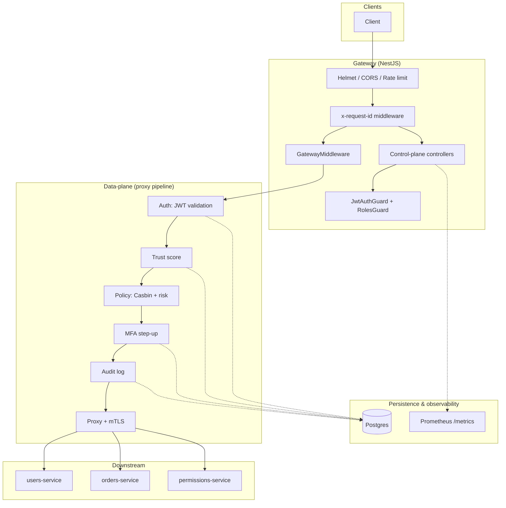
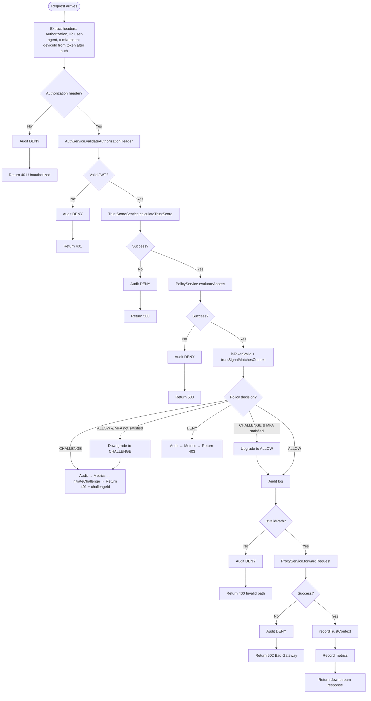
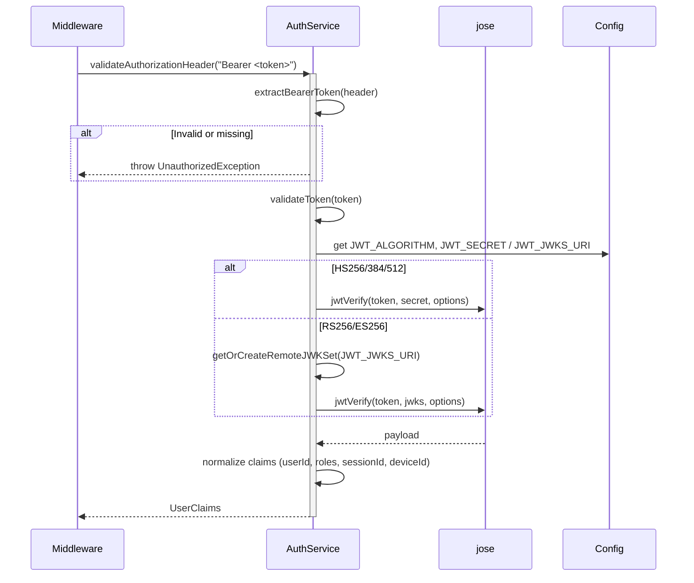

# Zero-Trust Access Gateway — Flowcharts & Sequence Diagrams

This document contains Mermaid flowcharts and sequence diagrams for the core components and flows. Render in any Markdown viewer that supports Mermaid (e.g. GitHub, GitLab, VS Code with Mermaid extension).

---

## Table of contents

1. [System overview](#1-system-overview)
2. [Data-plane pipeline flowchart](#2-data-plane-pipeline-flowchart)
3. [Data-plane request sequence diagram](#3-data-plane-request-sequence-diagram)
4. [Authentication (JWT) sequence diagram](#4-authentication-jwt-sequence-diagram)
5. [Trust score calculation flowchart](#5-trust-score-calculation-flowchart)
6. [Policy evaluation flowchart](#6-policy-evaluation-flowchart)
7. [MFA challenge & verify sequence diagram](#7-mfa-challenge--verify-sequence-diagram)
8. [Proxy forward sequence diagram](#8-proxy-forward-sequence-diagram)
9. [Bootstrap & app wiring flowchart](#9-bootstrap--app-wiring-flowchart)

---

## 1. System overview

High-level components and how traffic is split between control-plane and data-plane.



---

## 2. Data-plane pipeline flowchart

Step-by-step decision flow inside `GatewayMiddleware.use()`.



---

## 3. Data-plane request sequence diagram

End-to-end sequence for a single proxied request (happy path: ALLOW).

```mermaid
sequenceDiagram
  autonumber
  participant Client
  participant GatewayMiddleware
  participant AuthService
  participant TrustScoreService
  participant PolicyService
  participant MfaService
  participant AuditService
  participant ProxyService
  participant Microservice

  Client->>+GatewayMiddleware: HTTP request (Authorization, path)
  GatewayMiddleware->>GatewayMiddleware: Extract context (IP, userAgent); deviceId from UserClaims after auth
  GatewayMiddleware->>+AuthService: validateAuthorizationHeader(authHeader)
  AuthService-->>-GatewayMiddleware: UserClaims
  GatewayMiddleware->>+TrustScoreService: calculateTrustScore(userId, deviceId, ip, userAgent)
  TrustScoreService-->>-GatewayMiddleware: TrustScoreResult (score, level, factors)
  GatewayMiddleware->>+PolicyService: evaluateAccess(userClaims, score, path, method)
  PolicyService-->>-GatewayMiddleware: PolicyDecision (ALLOW|DENY|CHALLENGE)
  GatewayMiddleware->>+MfaService: isTokenValid(userId, mfaToken, context)
  MfaService-->>-GatewayMiddleware: boolean
  GatewayMiddleware->>+TrustScoreService: trustSignalMatchesContext(userId, deviceId, ip)
  TrustScoreService-->>-GatewayMiddleware: boolean
  Note over GatewayMiddleware: Adjust ALLOW/CHALLENGE if MFA not satisfied
  GatewayMiddleware->>+AuditService: logAccessDecision(...)
  AuditService-->>-GatewayMiddleware: (best effort)
  GatewayMiddleware->>+ProxyService: forwardRequest(service, method, path, headers, body, userClaims, score)
  ProxyService->>Microservice: HTTPS + mTLS (x-user-id, x-roles, x-trust-score)
  Microservice-->>ProxyService: response
  ProxyService-->>-GatewayMiddleware: forwarded response
  GatewayMiddleware->>TrustScoreService: recordTrustContext(userId, deviceId, ip)
  GatewayMiddleware->>GatewayMiddleware: recordRequestMetrics(...)
  GatewayMiddleware-->>-Client: downstream status + body + headers
```

---

## 4. Authentication (JWT) sequence diagram

How the gateway validates the Bearer token and produces `UserClaims`.



---

## 5. Trust score calculation flowchart

How `TrustScoreService.calculateTrustScore()` computes the risk score and factors.

```mermaid
flowchart LR
  subgraph Input
    userId[userId]
    deviceId[deviceId]
    ip[ip]
    userAgent[userAgent]
  end

  subgraph Telemetry
    getSignal[getSignal(userId, deviceId)]
    detectFreq[detectHighFrequency(userId)]
    cleanup[cleanupActivity]
  end

  subgraph Heuristics
    trustedDevice[isTrustedDevice?]
    ipReputation[evaluateIpReputation]
    geoConsistent[isGeolocationConsistent?]
  end

  subgraph Score
    base[base weight]
    deviceAdj[± device weight]
    ipAdj[± IP weight]
    geoAdj[± geo weight]
    freqAdj[± frequency weight]
    clamp[clamp 0..1]
    level[level: LOW / MEDIUM / HIGH]
  end

  userId --> getSignal
  deviceId --> getSignal
  userId --> detectFreq
  getSignal --> trustedDevice
  getSignal --> ipReputation
  ip --> ipReputation
  getSignal --> geoConsistent
  ip --> geoConsistent
  getSignal --> geoConsistent

  base --> deviceAdj
  trustedDevice --> deviceAdj
  deviceAdj --> ipAdj
  ipReputation --> ipAdj
  ipAdj --> geoAdj
  geoConsistent --> geoAdj
  geoAdj --> freqAdj
  detectFreq --> freqAdj
  freqAdj --> clamp
  clamp --> level
  level --> Result[(score, level, factors)]
  cleanup --> Result
```

---

## 6. Policy evaluation flowchart

How `PolicyEvaluatorService.evaluatePolicies()` combines Casbin and risk thresholds.

```mermaid
flowchart TD
  Start([evaluateAccess: userClaims, riskScore, resource, path, method]) --> Subjects[Build subjects: user:userId, role:role1, ...]
  Subjects --> NoSub{Any subject?}
  NoSub -->|No| Deny1[DENY: Unauthenticated subject]
  NoSub -->|Yes| Casbin[Casbin enforcer.enforce(subject, resource, action)]
  Casbin --> Allowed{Casbin allow?}
  Allowed -->|No| Deny2[DENY: Policy denied]
  Allowed -->|Yes| RiskCheck{riskScore valid?}
  RiskCheck -->|No| Deny3[DENY: Invalid risk]
  RiskCheck -->|Yes| HighRisk{score > DENY_THRESHOLD?}
  HighRisk -->|Yes| Deny4[DENY: Risk too high]
  HighRisk -->|No| ChallengeRisk{score > CHALLENGE_THRESHOLD?}
  ChallengeRisk -->|Yes| Challenge[CHALLENGE: Step-up required]
  ChallengeRisk -->|No| Allow[ALLOW]
```

---

## 7. MFA challenge & verify sequence diagram

Flow when policy returns CHALLENGE: initiate challenge, user verifies, then uses MFA token on subsequent requests.

```mermaid
sequenceDiagram
  participant Client
  participant Gateway
  participant MfaService
  participant MfaRepository
  participant TrustScoreService

  Note over Client,TrustScoreService: Request gets CHALLENGE
  Gateway->>+MfaService: initiateChallenge(userId, deviceId, ip, path, method)
  MfaService->>MfaService: Rate limit (per user / window)
  MfaService->>MfaService: generateId('chal'), generateCode()
  MfaService->>+MfaRepository: createChallenge(challengeId, userId, code, expiresAt, ip, deviceId, locationFingerprint)
  MfaRepository-->>-MfaService: ok
  MfaService-->>-Gateway: { challengeId, expiresAt }
  Gateway-->>Client: 401 Challenge Required, challengeId, expiresAt
  Note over Client: User obtains code (e.g. from log / SMS)

  Client->>Gateway: POST /mfa/verify { challengeId, code } + Authorization (deviceId from token)
  Gateway->>+MfaService: verifyChallenge(userId, challengeId, code, context)
  MfaService->>MfaRepository: get challenge, validate code & context (IP, device, location)
  MfaRepository-->>MfaService: challenge
  MfaService->>MfaService: context match? (IP, device_id, location_fingerprint)
  MfaService->>MfaRepository: markChallengeVerified(challengeId)
  MfaRepository-->>MfaService: ok
  MfaService->>MfaService: sign MFA JWT (sub, ip, deviceId, locationFingerprint, exp); no DB write
  MfaService-->>-Gateway: { mfaToken (JWT), expiresAt }
  Gateway->>TrustScoreService: recordTrustContext(userId, deviceId, ip, mfaVerifiedAt)
  Gateway-->>Client: 200 { mfaToken, expiresAt }

  Note over Client,TrustScoreService: Next request with MFA token
  Client->>Gateway: Request + Authorization + X-MFA-Token
  Gateway->>MfaService: isTokenValid(userId, mfaToken, context)
  MfaService->>MfaService: verify JWT (signature, expiry); check payload (sub, ip, deviceId, location) vs request context
  Note over MfaService: No DB lookup; token is stateless JWT
  MfaService-->>Gateway: true
  Gateway->>TrustScoreService: trustSignalMatchesContext(userId, deviceId, ip)
  TrustScoreService-->>Gateway: true
  Note over Gateway: CHALLENGE → ALLOW (MFA satisfied)
  Gateway-->>Client: Proxied response
```

---

## 8. Proxy forward sequence diagram

How `ProxyService.forwardRequest()` validates, builds the URL, and forwards with mTLS.

```mermaid
sequenceDiagram
  participant GatewayMiddleware
  participant ProxyService
  participant ServiceRegistryService
  participant MtlsService
  participant Downstream

  GatewayMiddleware->>+ProxyService: forwardRequest(serviceName, method, path, headers, body, userClaims, trustScore)
  ProxyService->>ProxyService: Validate method, path (isValidPath)
  ProxyService->>+ServiceRegistryService: getBaseUrl(serviceName)
  ServiceRegistryService-->>-ProxyService: baseUrl (allowlisted)
  ProxyService->>ProxyService: Build full URL; reject if host not allowlisted
  ProxyService->>ProxyService: Strip Authorization/Cookie; set x-gateway-request, x-user-id, x-roles, x-trust-score
  ProxyService->>+MtlsService: createAgent(hostname)
  MtlsService-->>-ProxyService: HTTPS agent (client certs, CA)
  ProxyService->>ProxyService: Circuit breaker check
  ProxyService->>Downstream: HTTP request (method, url, headers, body, agent) [retries]
  Downstream-->>ProxyService: response
  ProxyService->>ProxyService: Record circuit breaker result
  ProxyService-->>-GatewayMiddleware: { status, headers, data }
```

---

## 9. Bootstrap & app wiring flowchart

How the application starts and wires global middleware, guards, and modules.

```mermaid
flowchart TD
  main[main.ts] --> Create[NestFactory.create(AppModule)]
  Create --> Validate[validateCriticalConfig]
  Validate --> Strict{STRICT_CONFIG or NODE_ENV=production?}
  Strict -->|Yes| CheckJwt[JWT config: JWT_SECRET or JWT_JWKS_URI]
  Strict -->|No| Configure
  CheckJwt --> CheckMtls[MTLS paths: CA, cert, key]
  CheckMtls --> CheckRegistry[SERVICE_REGISTRY JSON]
  CheckRegistry --> Configure[configureApp: helmet, correlation, CORS, rate limit]
  Configure --> ValidationPipe[ValidationPipe]
  ValidationPipe --> ExceptionFilter[HttpExceptionFilter]
  ExceptionFilter --> Listen[app.listen(PORT)]

  subgraph AppModule
    Config[ConfigModule.forRoot]
    HttpMod[HttpModule]
    AuthMod[AuthModule]
    PolicyMod[PolicyModule]
    TrustMod[TrustScoreModule]
    ProxyMod[ProxyModule]
    AuditMod[AuditModule]
    MetricsMod[MetricsModule]
    GatewayMod[GatewayModule]
    MfaMod[MfaModule]
    Guards[APP_GUARD: JwtAuthGuard, RolesGuard]
  end

  Create --> AppModule
```

---

## Viewing the diagrams

- **GitHub / GitLab**: Mermaid is rendered automatically in `.md` files.
- **VS Code**: Install the "Mermaid" or "Markdown Preview Mermaid Support" extension.
- **CLI**: Use [Mermaid CLI](https://github.com/mermaid-js/mermaid-cli) to export to PNG/SVG:
  ```bash
  npx mmdc -i docs/DIAGRAMS.md -o docs/diagrams-output.pdf
  ```
- **Online**: Paste a diagram block into [mermaid.live](https://mermaid.live).

For more detail on each component, see [CODEBASE.md](./CODEBASE.md) and [STARTUP_GUIDE.md](./STARTUP_GUIDE.md).
