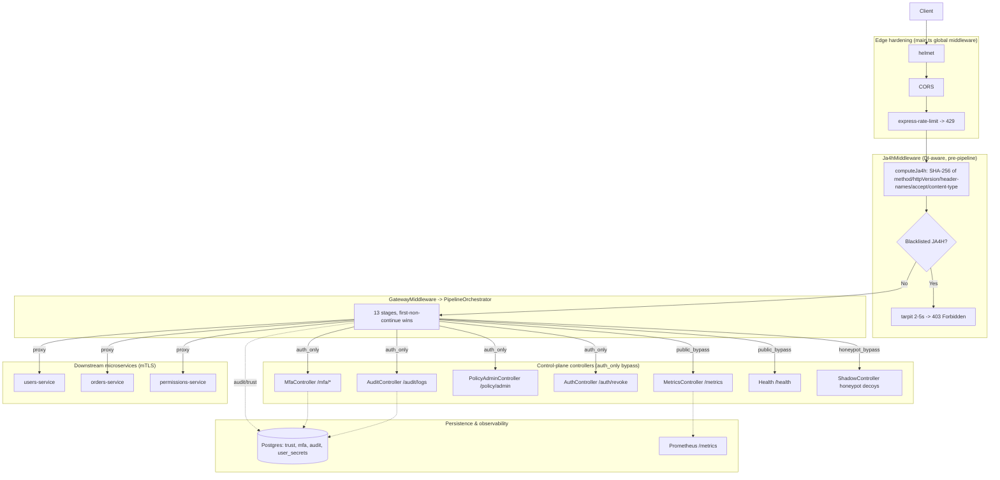
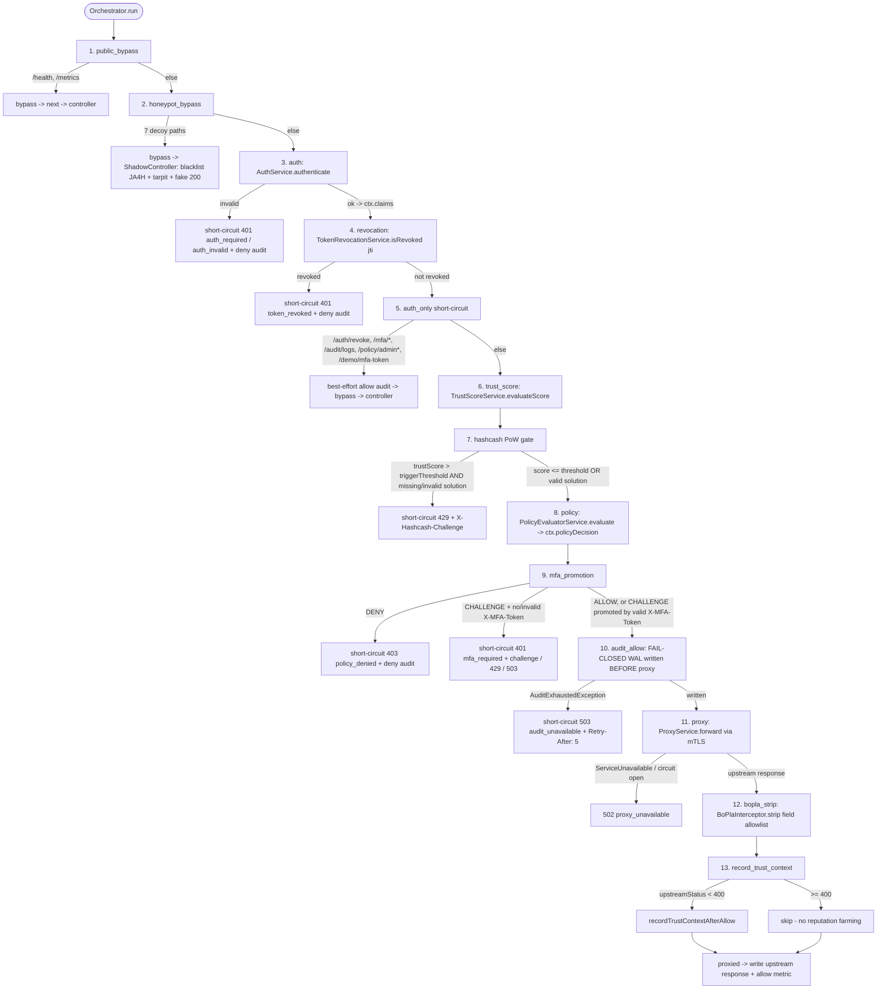
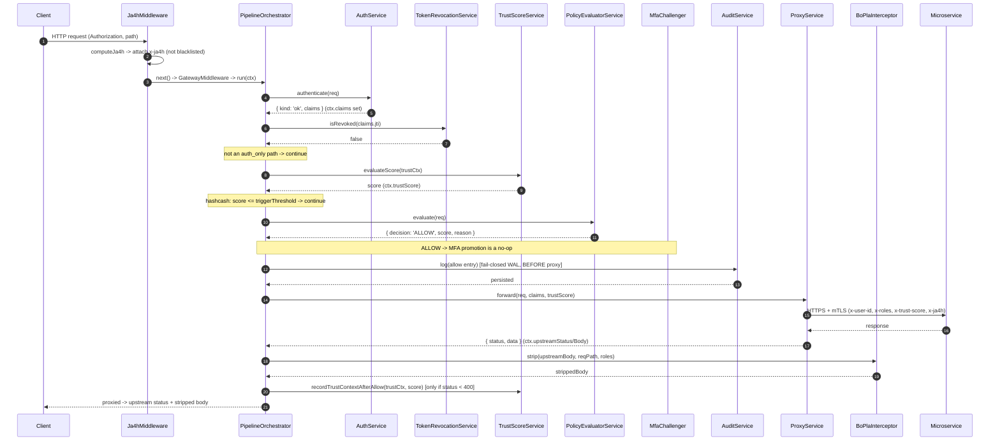
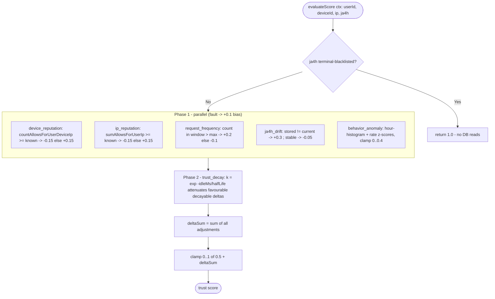
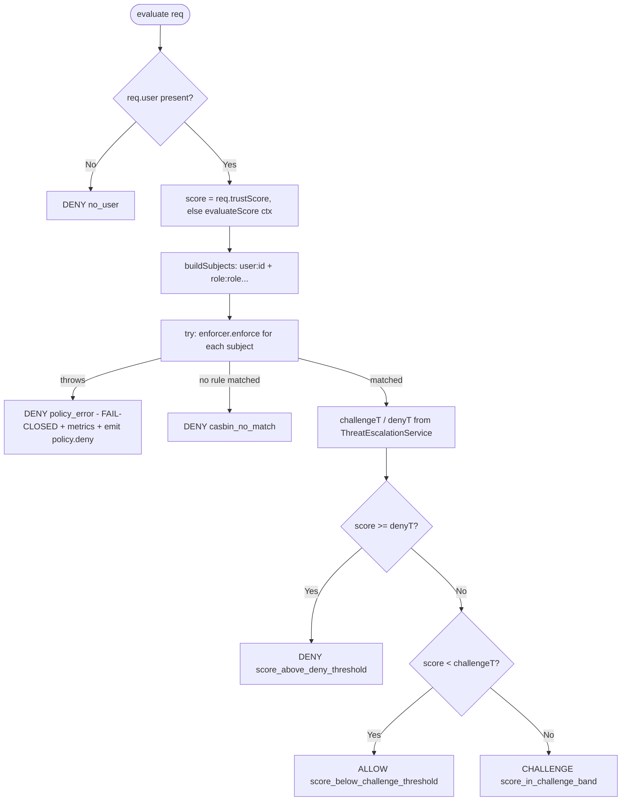
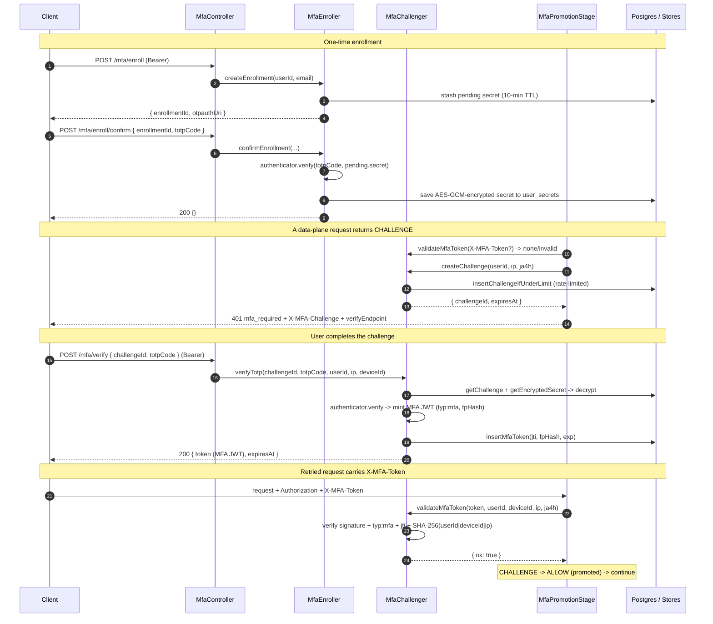
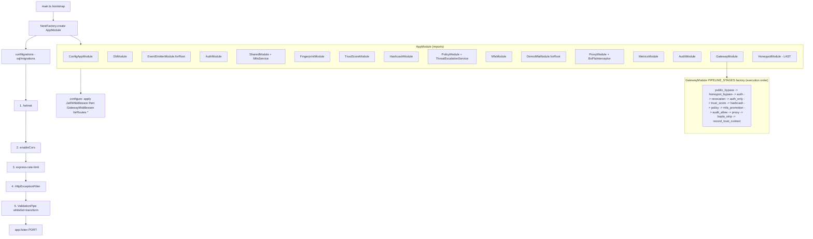

# Zero-Trust Access Gateway — Flowcharts & Sequence Diagrams

This document contains Mermaid flowcharts and sequence diagrams describing the **current** architecture of the gateway: a pre-pipeline JA4H fingerprinting middleware followed by a **13-stage fail-fast orchestrated pipeline**. Every diagram reflects the code as it exists today (method names, stage order, and exit conditions are taken straight from source).

Render in any Markdown viewer that supports Mermaid (e.g. GitHub, GitLab, VS Code with a Mermaid extension).

For the *why* behind these mechanics see [`HARDENING_ARCHITECTURE.md`](./HARDENING_ARCHITECTURE.md); for a prose, step-by-step walkthrough of a request see [`THESIS_PIPELINE.md`](./THESIS_PIPELINE.md).

---

## Table of contents

1. [System overview](#1-system-overview)
2. [The 13-stage data-plane pipeline](#2-the-13-stage-data-plane-pipeline)
3. [Data-plane happy-path sequence (ALLOW)](#3-data-plane-happy-path-sequence-allow)
4. [Authentication: JWT validation](#4-authentication-jwt-validation)
5. [Trust score: seven signals](#5-trust-score-seven-signals)
6. [Policy evaluation](#6-policy-evaluation)
7. [MFA: enroll, challenge & verify](#7-mfa-enroll-challenge--verify)
8. [Proxy forward](#8-proxy-forward)
9. [Bootstrap & module wiring](#9-bootstrap--module-wiring)

---

## 1. System overview

A request first hits the global Express middleware configured in `main.ts` (Helmet → CORS → rate-limit), then the DI-aware `Ja4hMiddleware`, and finally the `GatewayMiddleware`, which delegates the request to the `PipelineOrchestrator`. The orchestrator runs the 13 stages in canonical order and returns on the first non-`continue` outcome. Public paths, honeypot decoys, and control-plane (auth-only) paths short-circuit early; only fully-authorized data-plane requests reach the mTLS proxy and the downstream microservices.



---

## 2. The 13-stage data-plane pipeline

`PipelineOrchestrator.run()` iterates the `PIPELINE_STAGES` list (assembled in canonical order by the factory provider in `gateway.module.ts`) and returns the first stage outcome whose `kind` is not `continue`. A `bypass` invokes Express `next()` so a controller handles the request; a `short-circuit` writes a terminal HTTP response; `proxied` writes the upstream response. The fail-closed ALLOW audit (stage 10) is written **before** the proxy call (stage 11) — if the WAL is exhausted the request is rejected with 503 and never reaches downstream.



---

## 3. Data-plane happy-path sequence (ALLOW)

End-to-end sequence for a single proxied request that is authenticated, low-risk, and policy-ALLOWed. The fail-closed ALLOW audit precedes the proxy call; trust context is recorded only after a successful (`< 400`) upstream response.



---

## 4. Authentication: JWT validation

`AuthService.authenticate()` extracts the `Bearer` token, then `validateToken()` decodes the protected header and **routes by algorithm**: `HS256` verifies against the symmetric secret; `RS256`/`ES256` verify against a local SPKI public key or a cached remote JWKS. The accepted algorithm set is pinned to `[HS256, RS256, ES256]` (so `alg: none` and any substitution are rejected), `jti` + `sub` are required claims, and a token carrying `typ: 'mfa'` is rejected here (MFA tokens are only valid via `MfaChallenger.validateMfaToken`). Failures become `UnauthorizedException` values, surfaced as a 401 by `AuthStage`.

```mermaid
sequenceDiagram
  participant Stage as AuthStage
  participant Auth as AuthService
  participant jose
  participant Config as AuthConfig

  Stage->>Auth: authenticate(req)
  Auth->>Auth: split "Bearer <token>"
  alt missing / wrong scheme
    Auth-->>Stage: { kind: 'invalid', reason: 'missing' | 'scheme' }
  end
  Auth->>Auth: validateToken(token)
  Auth->>jose: decodeProtectedHeader(token) -> header.alg
  Note over Auth: options pin algorithms [HS256, RS256, ES256]; require jti + sub
  alt alg == HS256
    Auth->>Config: jwtSecret
    Auth->>jose: jwtVerify(token, secret, options)
  else alg == RS256 or ES256
    alt jwtPublicKey present
      Auth->>jose: importSPKI -> jwtVerify(token, key, options)
    else jwksUri present
      Auth->>jose: createRemoteJWKSet (cached) -> jwtVerify(token, jwks, options)
    end
  else any other alg (incl. none)
    Auth-->>Stage: UnauthorizedException "Algorithm not allowed"
  end
  jose-->>Auth: payload
  alt payload.typ == 'mfa'
    Auth-->>Stage: UnauthorizedException "MFA token cannot be used as access token"
  end
  Auth->>Auth: extractClaims (sub, roles[], jti, exp, deviceId required)
  Auth-->>Stage: { kind: 'ok', claims: UserClaims }
```

---

## 5. Trust score: seven signals

`TrustScoreService.evaluateScore()` returns a non-terminal score in `[0,1]`. If the request's JA4H is **terminal-blacklisted**, it returns `1.0` immediately with no DB reads. Otherwise it evaluates the three signal-rules plus the JA4H-drift and behavior-anomaly providers in parallel, then applies the Trust-Decay post-processor, sums all deltas onto a `0.5` baseline, and clamps to `[0,1]`. Any provider fault contributes a `+0.1` risk bias rather than crashing. There is **no geolocation signal**.



---

## 6. Policy evaluation

`PolicyEvaluatorService.evaluate()` builds Casbin subjects (`user:<id>` plus `role:<role>` for each role) and tests them against the resource + action. The Casbin path is fully wrapped: **any enforcer error returns DENY (`policy_error`)** — it never defaults to allow. When a subject matches, the trust score is mapped using the **live** challenge/deny thresholds read from `ThreatEscalationService` (which raises thresholds as Normal → Elevated → Critical based on a sliding window of threat signals).



---

## 7. MFA: enroll, challenge & verify

MFA is **TOTP-based**. A user first enrolls (`POST /mfa/enroll` → `MfaEnroller.createEnrollment` returns an `otpauthUri`; `POST /mfa/enroll/confirm` → `confirmEnrollment` validates the first TOTP code and persists an AES-256-GCM-encrypted secret). At request time, when policy returns CHALLENGE the user must present a valid `X-MFA-Token`; if absent or invalid the gateway creates a challenge (`MfaChallenger.createChallenge`) and replies 401 `mfa_required`. The user calls `POST /mfa/verify` with `{ challengeId, totpCode }`; `verifyTotp` checks the code against the decrypted secret and mints an MFA JWT (`typ: 'mfa'`, signed with `MFA_JWT_SECRET`, bound to `SHA-256(userId|deviceId|ip)`). That token, replayed as `X-MFA-Token`, promotes the next CHALLENGE to ALLOW.



---

## 8. Proxy forward

`ProxyService.forward()` resolves the service from the path prefix via the service registry (the SSRF allowlist), rejects unknown services, then runs the resolved hostname through `DnsRebindingGuard.assertSafe()` (blocks loopback `127.0.0.0/8`, `::1`, and `169.254.169.254` on every call — no caching). Header hygiene strips `authorization`/`cookie`/`x-forwarded-for`/`host` and injects `x-user-id`/`x-roles`/`x-trust-score`/`x-ja4h`. The per-service **opossum circuit breaker wraps the full retry loop** (one `fire()` per request; one failure recorded only after all retries exhaust). The mTLS agent comes from `MtlsService.getHttpsAgent()` (mtime-cached, with a CN allowlist for server certs).

```mermaid
sequenceDiagram
  participant Stage as ProxyStage
  participant Proxy as ProxyService
  participant Reg as ServiceRegistryService
  participant Dns as DnsRebindingGuard
  participant Cb as opossum CircuitBreaker
  participant Mtls as MtlsService
  participant Down as Downstream

  Stage->>Proxy: forward(req, claims, trustScore)
  Proxy->>Reg: extractServiceName(path) + resolve(name)
  alt unknown service
    Proxy-->>Stage: NotFoundException
  end
  Reg-->>Proxy: baseUrl (allowlisted) + stripped path
  Proxy->>Dns: assertSafe(target.hostname)  [fresh lookup, no cache]
  alt loopback / 169.254.169.254
    Dns-->>Proxy: ForbiddenException
  end
  Proxy->>Mtls: getHttpsAgent()  [mtime-cached]
  Mtls-->>Proxy: https.Agent (client cert + CA)
  Proxy->>Proxy: buildProxyHeaders - strip auth/cookie/xff/host; inject x-user-id/x-roles/x-trust-score/x-ja4h
  Proxy->>Cb: fire(axiosConfig)
  Note over Cb: breaker wraps the WHOLE retry loop (backoff 100/200/400ms)
  Cb->>Down: HTTPS + mTLS request (with retries)
  Down-->>Cb: response
  Cb-->>Proxy: AxiosResponse
  Proxy->>Proxy: assertValidProxyResponse
  alt circuit open
    Proxy-->>Stage: ServiceUnavailableException
  end
  Proxy-->>Stage: { status, data }
```

---

## 9. Bootstrap & module wiring

`main.ts` creates the Nest app, runs SQL migrations, then layers global Express middleware in a fixed order: **Helmet → CORS → rate-limit**, followed by the global exception filter and validation pipe. `AppModule.configure()` then registers the DI-aware middleware (`Ja4hMiddleware` first, `GatewayMiddleware` second) for all routes. `GatewayModule` wires the prerequisite feature modules plus the 13 stage providers and assembles them in execution order through the `PIPELINE_STAGES` factory.



---

## Viewing the diagrams

- **GitHub / GitLab**: Mermaid is rendered automatically in `.md` files.
- **VS Code**: Install the "Mermaid" or "Markdown Preview Mermaid Support" extension.
- **CLI**: Use [Mermaid CLI](https://github.com/mermaid-js/mermaid-cli) to export to PNG/SVG/PDF:
  ```bash
  npx mmdc -i docs/DIAGRAMS.md -o docs/diagrams-output.pdf
  ```
- **Online**: Paste a diagram block into [mermaid.live](https://mermaid.live).

For the mechanics and rationale behind each stage see [`HARDENING_ARCHITECTURE.md`](./HARDENING_ARCHITECTURE.md); for a narrative walkthrough of a request through the pipeline see [`THESIS_PIPELINE.md`](./THESIS_PIPELINE.md). For implementation reference and local setup see [`CODEBASE.md`](./CODEBASE.md) and [`STARTUP_GUIDE.md`](./STARTUP_GUIDE.md).
