# Zero-Trust Access Gateway — Hardening Architecture

Target-state architecture for the bulletproof gateway hardening initiative. Covers OWASP API Security 2023 compliance, custom differentiating features (JA4H fingerprinting, Hashcash PoW, shadow honeypots, BOPLA interceptor), and the fail-fast pipeline design.

For the **current** architecture diagrams, see [DIAGRAMS.md](./DIAGRAMS.md).

---

## Table of contents

1. [Component map](#1-component-map)
2. [Fail-fast pipeline](#2-fail-fast-pipeline)
3. [JA4H HTTP client fingerprinting](#3-ja4h-http-client-fingerprinting)
4. [Hashcash proof of work](#4-hashcash-proof-of-work)
5. [Shadow honeypot system](#5-shadow-honeypot-system)
6. [BOPLA response interceptor](#6-bopla-response-interceptor)
7. [Trust score model (7 signals)](#7-trust-score-model-7-signals)
8. [SSRF and DNS rebinding protection](#8-ssrf-and-dns-rebinding-protection)
9. [Token revocation](#9-token-revocation)
10. [Dynamic threat escalation](#10-dynamic-threat-escalation)
11. [Audit write-ahead buffer](#11-audit-write-ahead-buffer)
12. [File structure](#12-file-structure)

---

## 1. Component map

Every module and service after all hardening phases are implemented. Components marked with `*` are new.

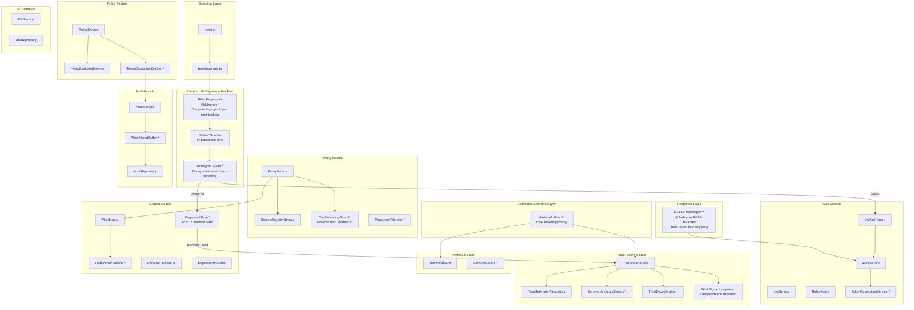

---

## 2. Fail-fast pipeline

The full request lifecycle. Every step is ordered so the cheapest rejections happen first. New steps are marked with `*`.

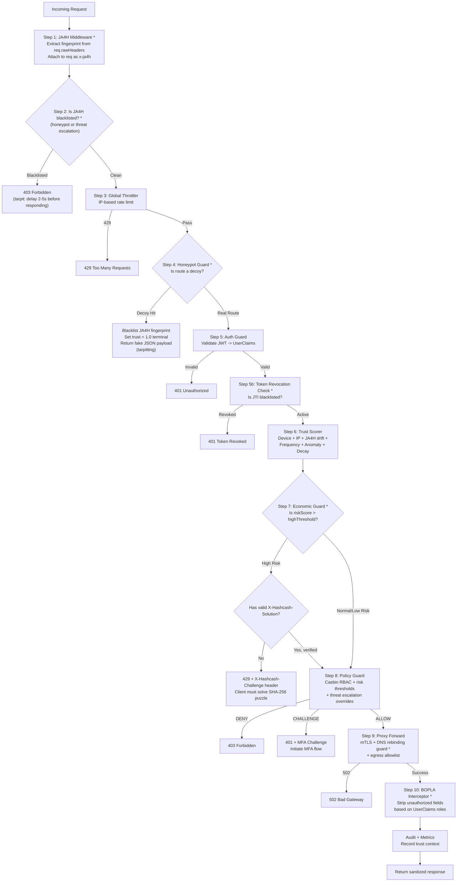

---

## 3. JA4H HTTP client fingerprinting

JA4H fingerprints the actual HTTP client implementation by examining the raw header ordering and casing. Unlike User-Agent (a trivially spoofable string), JA4H is deeply baked into the HTTP library the client uses and is nearly impossible to spoof without reimplementing the entire HTTP stack.

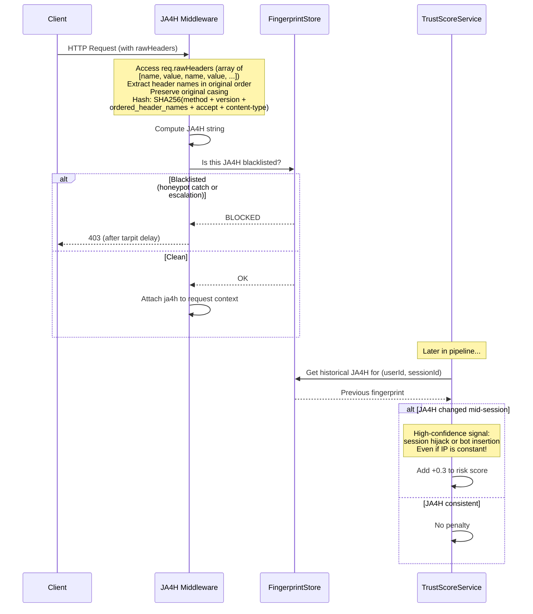

---

## 4. Hashcash proof of work

Instead of just blocking suspicious clients, impose an economic cost that scales with risk. Legitimate browsers solve the puzzle in milliseconds; bot farms spend hundreds of milliseconds per request, making large-scale attacks economically infeasible.

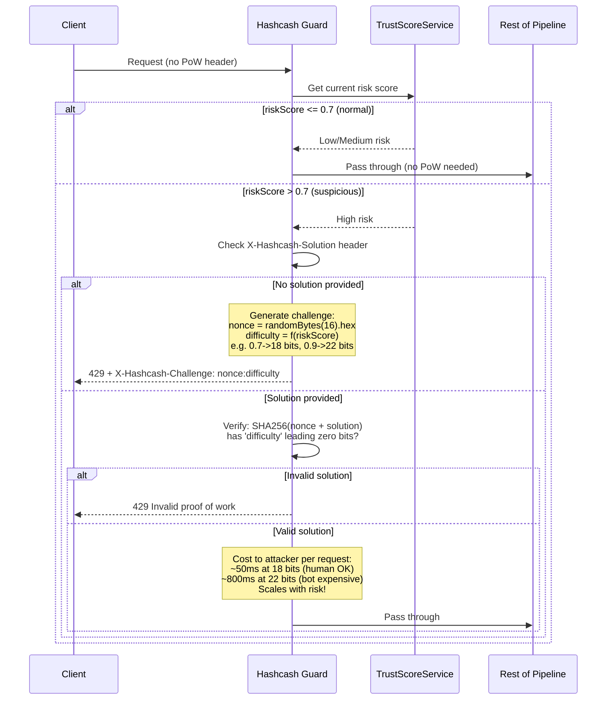

---

## 5. Shadow honeypot system

Proactive deception with zero false positives. Legitimate users never hit these routes, so any hit is a guaranteed scanner/attacker.

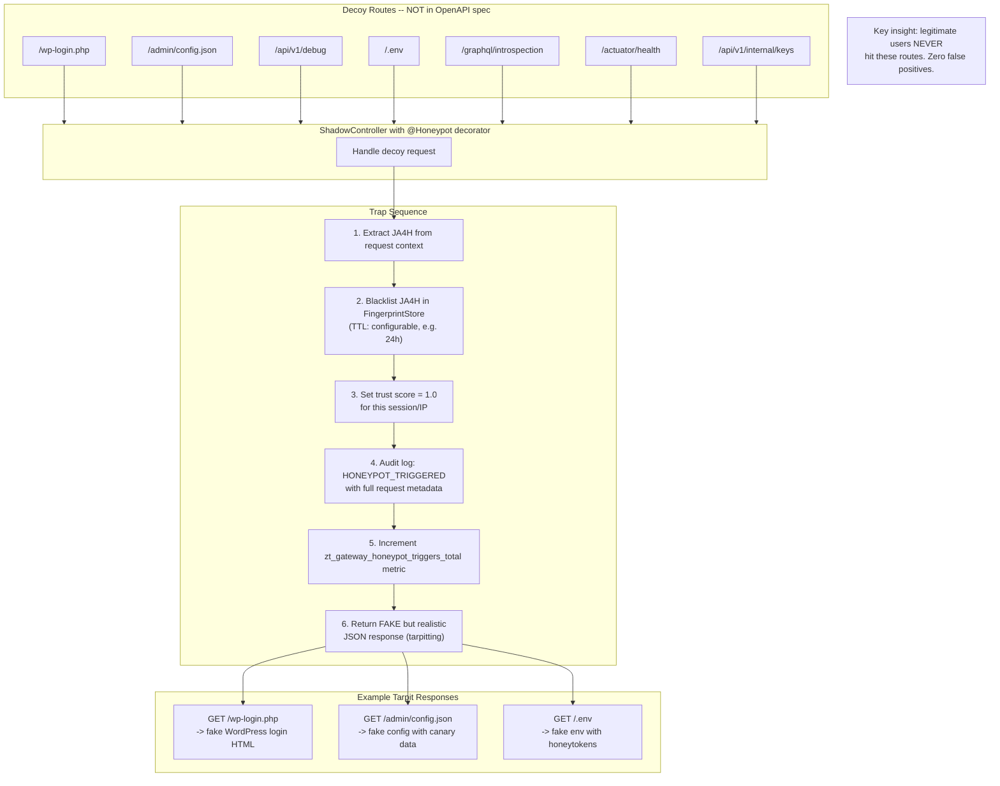

---

## 6. BOPLA response interceptor

Mitigates OWASP API3:2023 (Broken Object Property Level Authorization) at the gateway level. Even if a backend microservice returns all fields, the gateway enforces data-level least privilege.

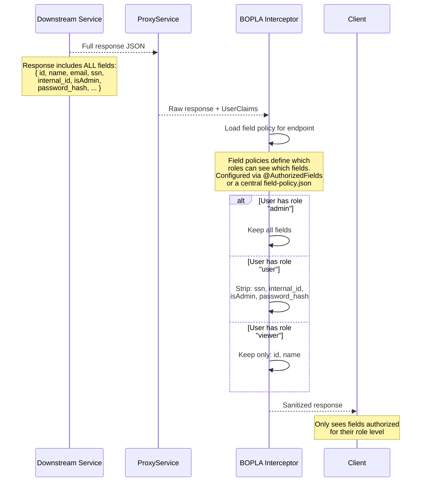

### Field policy configuration

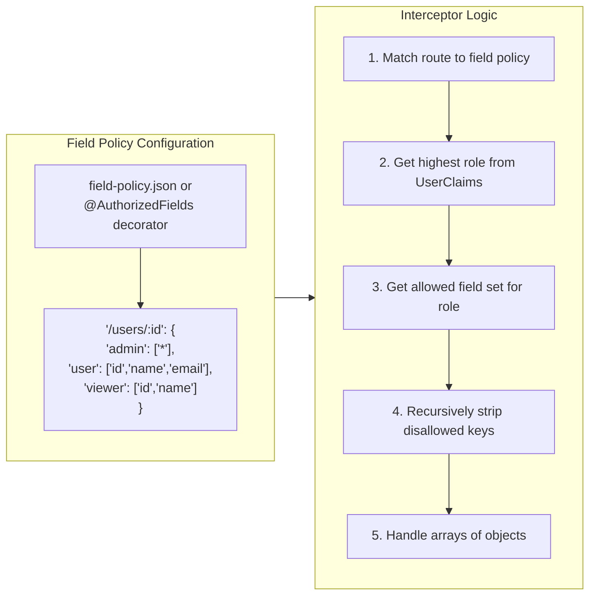

---

## 7. Trust score model (7 signals)

Streamlined from the original 9 signals. User-Agent is replaced by JA4H (captures real client identity). Geolocation is replaced by behavior anomaly detection (covers impossible-travel far better than IP subnet matching).

| Signal | Type | Effect |
|---|---|---|
| Device reputation | Historical | Known device reduces risk |
| IP reputation | Historical | Trusted IP reduces risk |
| JA4H fingerprint drift | Real-time | Mid-session change = high-confidence hijack |
| Request frequency | Real-time | Burst traffic increases risk |
| Trust decay | Time-based | Idle users lose trust progressively |
| Behavior anomaly | Statistical | Deviation from profile increases risk |
| Honeypot blacklist | Terminal | Instant score = 1.0 |

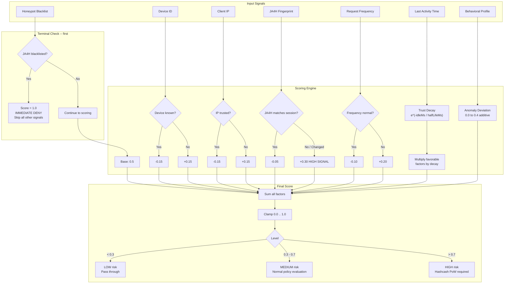

---

## 8. SSRF and DNS rebinding protection

Resolves hostnames to IPs before connecting and validates the resolved IP is not in private/loopback/metadata ranges. Cross-checks against the service registry allowlist.

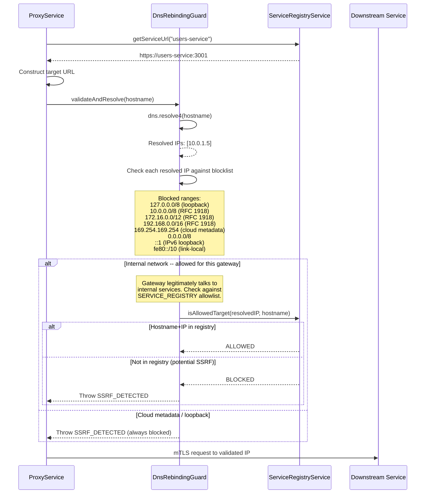

---

## 9. Token revocation

Immediate invalidation of stolen or leaked JWTs via an in-memory blacklist keyed by the `jti` claim.

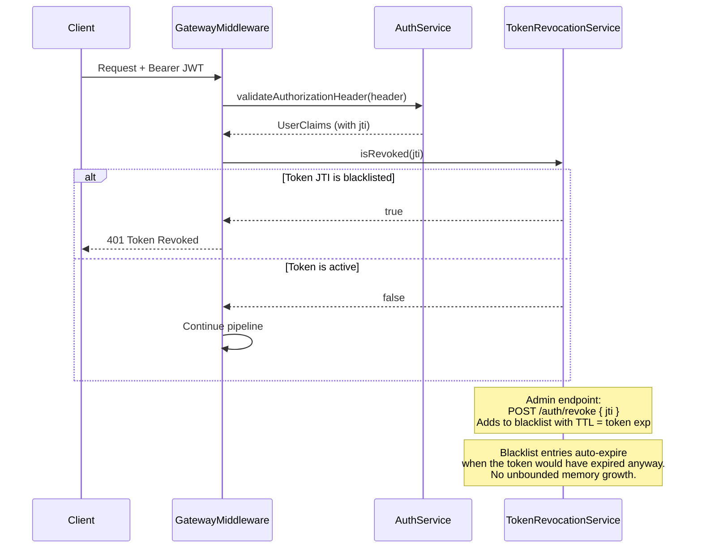

---

## 10. Dynamic threat escalation

Monitors audit log signals and automatically tightens policies when threat thresholds are crossed. Includes auto-cooldown so escalations decay over time.

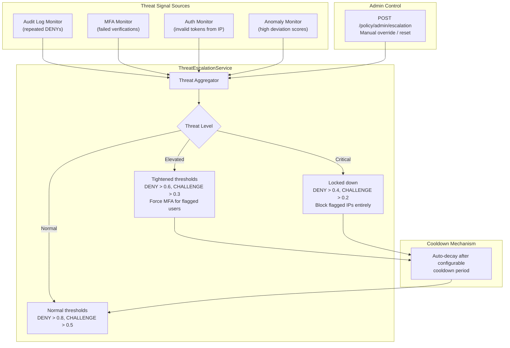

---

## 11. Audit write-ahead buffer

Guarantees audit entries are persisted before allowing requests through. For ALLOW decisions, the gateway blocks the response until the audit write succeeds (audit-before-allow pattern).

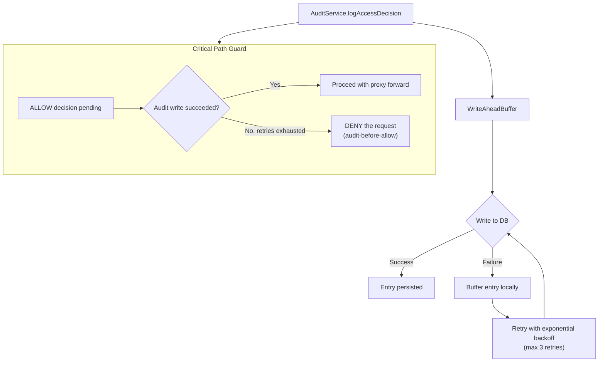

---

## 12. File structure

New files and modules after all hardening phases.

```
src/
├── auth/
│   ├── auth.service.ts              (enhanced: issuer/audience validation)
│   ├── token-revocation.service.ts  * NEW
│   ├── jwt.service.ts
│   ├── jwt-auth.guard.ts
│   └── ...
├── gateway/
│   ├── gateway.middleware.ts         (rewritten: 10-step fail-fast pipeline)
│   └── gateway.module.ts
├── fingerprint/                      * NEW MODULE
│   ├── fingerprint.module.ts
│   ├── ja4h.middleware.ts           * (rawHeaders -> JA4H hash)
│   ├── fingerprint.store.ts         * (JA4H tracking + blacklist)
│   └── __tests__/
│       └── ja4h.middleware.spec.ts
├── honeypot/                         * NEW MODULE
│   ├── honeypot.module.ts
│   ├── honeypot.decorator.ts        * (@Honeypot())
│   ├── honeypot.guard.ts            * (decoy route detection)
│   ├── shadow.controller.ts         * (fake endpoints + tarpit)
│   └── __tests__/
│       └── honeypot.guard.spec.ts
├── hashcash/                         * NEW MODULE
│   ├── hashcash.module.ts
│   ├── hashcash.guard.ts            * (PoW challenge/verify)
│   ├── hashcash.util.ts             * (SHA-256 puzzle logic)
│   └── __tests__/
│       └── hashcash.guard.spec.ts
├── policy/
│   ├── threat-escalation.service.ts * NEW
│   └── ...
├── proxy/
│   ├── dns-rebinding.guard.ts       * NEW
│   ├── response-validator.ts        * NEW
│   └── ...
├── trust-score/
│   ├── trust-score.service.ts       (enhanced: JA4H + decay + anomaly)
│   ├── behavior-anomaly.service.ts  * NEW
│   └── ...
├── interceptors/                     * NEW DIRECTORY
│   ├── bopla.interceptor.ts         * (field stripping)
│   ├── authorized-fields.decorator.ts * (@AuthorizedFields)
│   └── field-policy.json            * (route->role->fields map)
├── audit/
│   ├── write-ahead-buffer.ts        * NEW
│   └── ...
├── shared/
│   ├── health.service.ts            * NEW
│   ├── cert-monitor.service.ts      * NEW
│   └── ...
└── metrics/
    └── metrics.service.ts           (enhanced: security-specific metrics)
```

---

## Viewing the diagrams

- **GitHub / GitLab**: Mermaid is rendered automatically in `.md` files.
- **VS Code**: Install the "Mermaid" or "Markdown Preview Mermaid Support" extension.
- **CLI**: Use [Mermaid CLI](https://github.com/mermaid-js/mermaid-cli) to export to PNG/SVG:
  ```bash
  npx mmdc -i docs/HARDENING_ARCHITECTURE.md -o docs/hardening-diagrams.pdf
  ```
- **Online**: Paste a diagram block into [mermaid.live](https://mermaid.live).

For the current (pre-hardening) architecture, see [DIAGRAMS.md](./DIAGRAMS.md). For implementation details, see [CODEBASE.md](./CODEBASE.md) and [STARTUP_GUIDE.md](./STARTUP_GUIDE.md).
