# Zero-Trust Access Gateway — Hardening Architecture

As-built architecture of the hardened gateway. Covers OWASP API Security 2023 compliance, the differentiating security features (JA4H fingerprinting, Hashcash PoW, shadow honeypots, BOPLA response stripping), and the fail-fast pipeline as it is implemented today.

Companion docs: [DIAGRAMS.md](./DIAGRAMS.md) is the diagram reference; [THESIS_PIPELINE.md](./THESIS_PIPELINE.md) is the narrative walkthrough of the request lifecycle.

---

## Table of contents

1. [Component map](#1-component-map)
2. [Fail-fast pipeline](#2-fail-fast-pipeline)
3. [JA4H HTTP client fingerprinting](#3-ja4h-http-client-fingerprinting)
4. [Hashcash proof of work](#4-hashcash-proof-of-work)
5. [Shadow honeypot system](#5-shadow-honeypot-system)
6. [BOPLA response interceptor](#6-bopla-response-interceptor)
7. [Trust score model (7 signals)](#7-trust-score-model-7-signals)
8. [SSRF and DNS rebinding protection](#8-ssrf-and-dns-rebinding-protection)
9. [Token revocation](#9-token-revocation)
10. [Dynamic threat escalation](#10-dynamic-threat-escalation)
11. [Audit write-ahead buffer](#11-audit-write-ahead-buffer)
12. [File structure](#12-file-structure)

---

## 1. Component map

Every module and service in the hardened gateway. Security-specific components are called out inline.

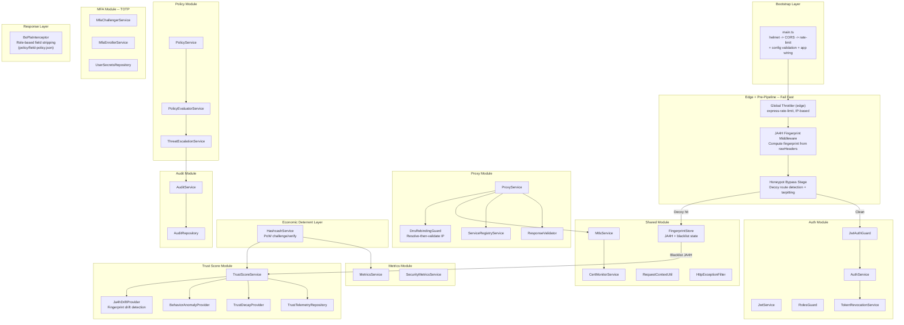

---

## 2. Fail-fast pipeline

The full request lifecycle. Two pieces run *before* the orchestrated pipeline as NestJS/Express middleware — the global throttler (edge, `express-rate-limit` in `main.ts`) and the JA4H fingerprint middleware. The pipeline itself is **13 stages** executed in canonical order by `PipelineOrchestrator` (factory order in `gateway.module.ts`'s `PIPELINE_STAGES`). Stages are ordered so the cheapest rejections happen first, and the ALLOW audit is fail-closed (written **before** proxy forwarding).

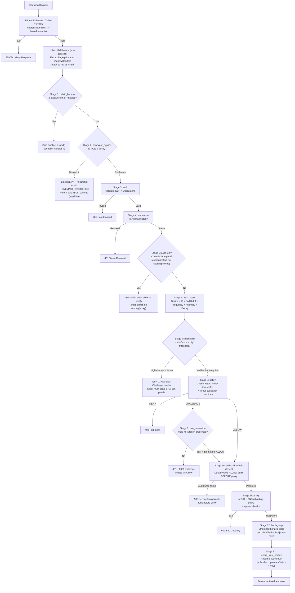

---

## 3. JA4H HTTP client fingerprinting

JA4H fingerprints the actual HTTP client implementation by examining the raw header ordering and casing. Unlike User-Agent (a trivially spoofable string), JA4H is deeply baked into the HTTP library the client uses and is nearly impossible to spoof without reimplementing the entire HTTP stack.

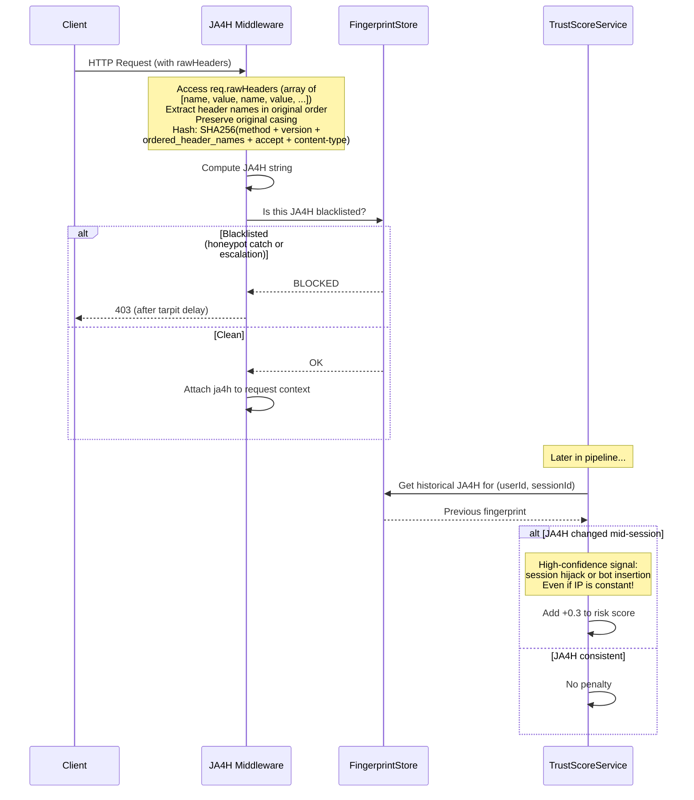

---

## 4. Hashcash proof of work

Instead of just blocking suspicious clients, impose an economic cost that scales with risk. Legitimate browsers solve the puzzle in milliseconds; bot farms spend hundreds of milliseconds per request, making large-scale attacks economically infeasible.

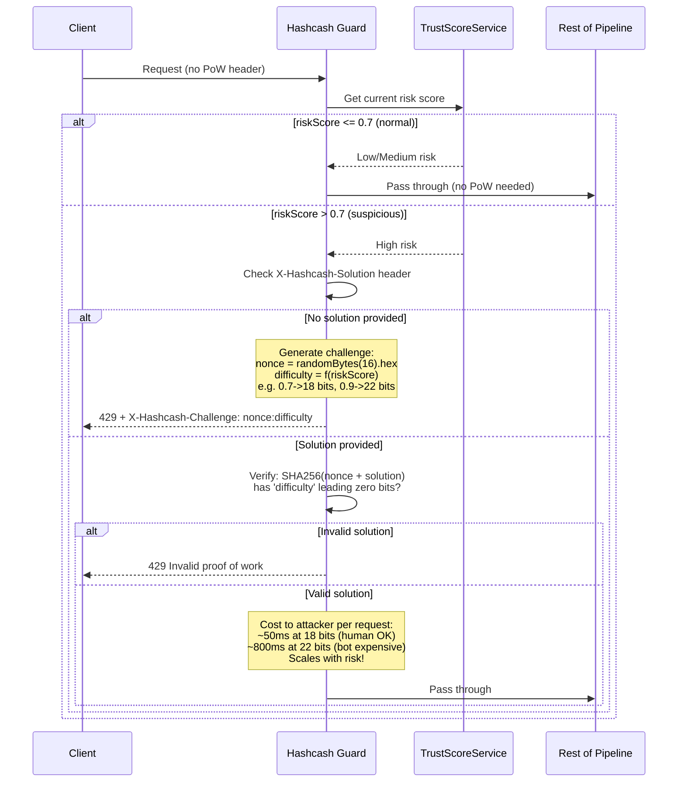

---

## 5. Shadow honeypot system

Proactive deception with zero false positives. Legitimate users never hit these routes, so any hit is a guaranteed scanner/attacker.

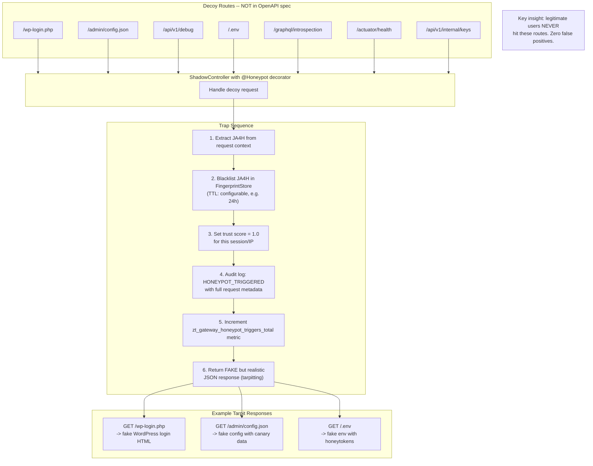

---

## 6. BOPLA response interceptor

Mitigates OWASP API3:2023 (Broken Object Property Level Authorization) at the gateway level. Even if a backend microservice returns all fields, the gateway enforces data-level least privilege.

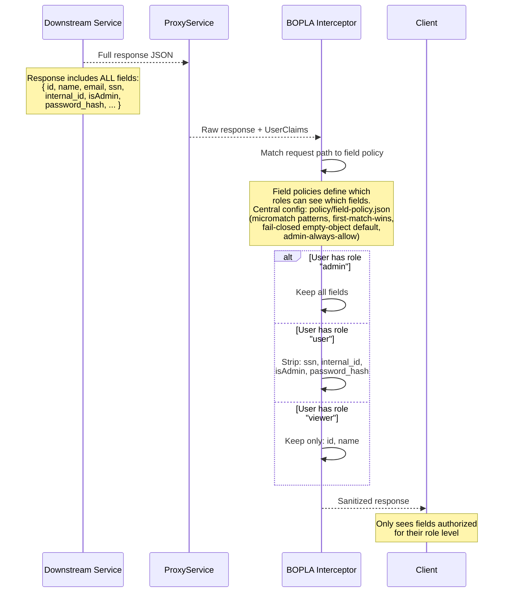

### Field policy configuration

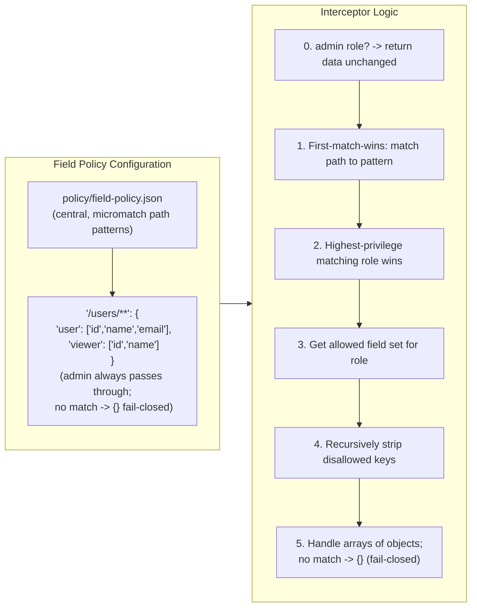

---

## 7. Trust score model (7 signals)

Streamlined from the original 9 signals. User-Agent is replaced by JA4H (captures real client identity). Geolocation is replaced by behavior anomaly detection (covers impossible-travel far better than IP subnet matching).

| Signal | Type | Effect |
|---|---|---|
| Device reputation | Historical | Known device reduces risk |
| IP reputation | Historical | Trusted IP reduces risk |
| JA4H fingerprint drift | Real-time | Mid-session change = high-confidence hijack |
| Request frequency | Real-time | Burst traffic increases risk |
| Trust decay | Time-based | Idle users lose trust progressively |
| Behavior anomaly | Statistical | Deviation from profile increases risk |
| Honeypot blacklist | Terminal | Instant score = 1.0 |

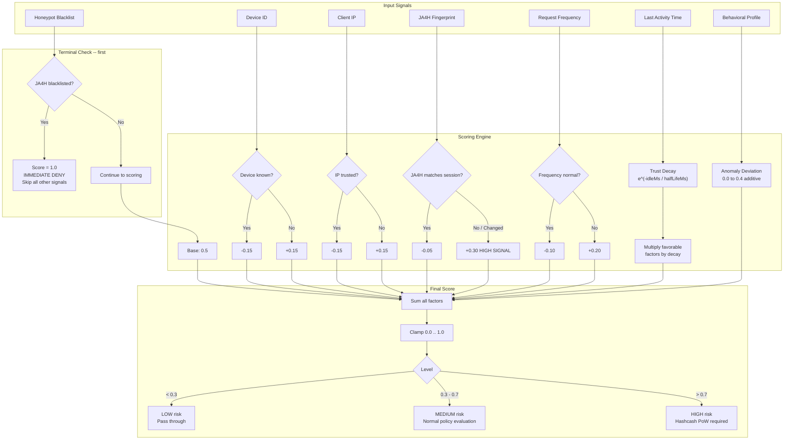

---

## 8. SSRF and DNS rebinding protection

Resolves hostnames to IPs before connecting and validates the resolved IP is not in private/loopback/metadata ranges. Cross-checks against the service registry allowlist.

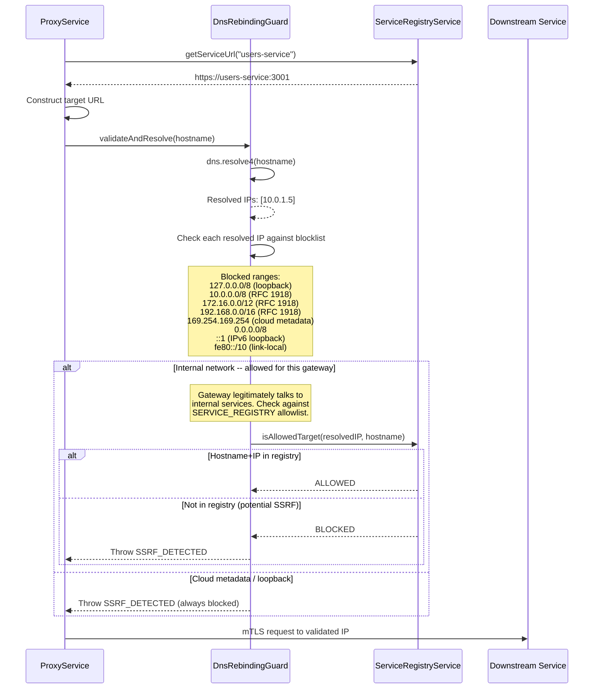

---

## 9. Token revocation

Immediate invalidation of stolen or leaked JWTs via an in-memory blacklist keyed by the `jti` claim.

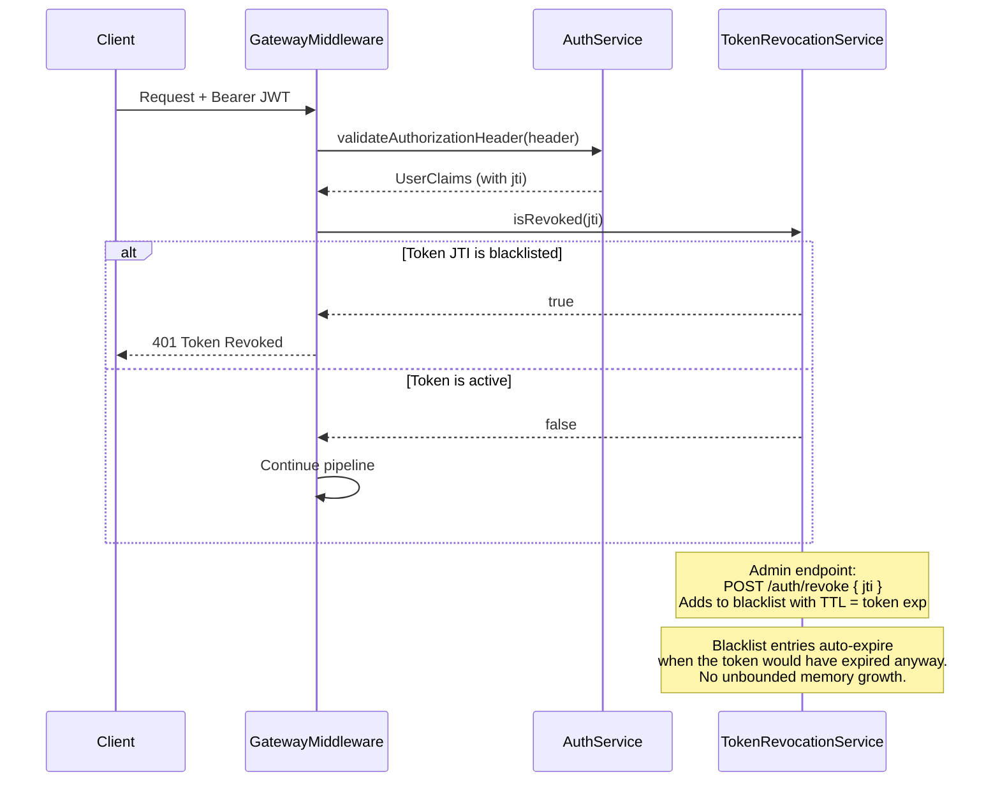

---

## 10. Dynamic threat escalation

`ThreatEscalationService` aggregates security signals over a bounded sliding window and **tightens the challenge/deny trust-score thresholds** as the system threat level rises (Normal -> Elevated -> Critical). Escalation is purely threshold-tightening — it does not block individual IPs or force per-user MFA. Cooldown is read-driven (no timers): once signals stop, the level steps back down one rung per elapsed cooldown window. A sticky manual override is available via the admin API.

The level is the max across per-signal-type counts: policy DENYs, invalid auth tokens, honeypot hits, and MFA rate-limits each have their own elevated/critical count thresholds. (`mfa.failed` and `audit.signal` subscribers exist but are not the primary drivers.)

The threshold numbers below are the **default values** from the config schema (`src/config/config.module.ts`); they are overridable via env (`POLICY_DENY_THRESHOLD`, `POLICY_ELEVATED_DENY_THRESHOLD`, `POLICY_CRITICAL_DENY_THRESHOLD`, and the `CHALLENGE` equivalents). Config validation enforces that critical is tighter than elevated, which is tighter than normal.

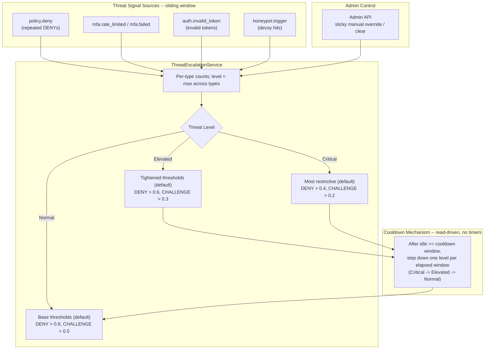

---

## 11. Audit write-ahead buffer

Guarantees ALLOW audit entries are persisted before the request is proxied (the `audit_allow` stage runs *before* `proxy`). For ALLOW decisions the write is fail-closed: `AuditService.log` retries with exponential backoff (50 -> 100 -> 200ms) and throws `AuditExhaustedException` if all retries fail, which surfaces as 503 + `Retry-After: 5`. CHALLENGE / DENY / AUTH_ONLY audits are best-effort (bounded timeout, never block).

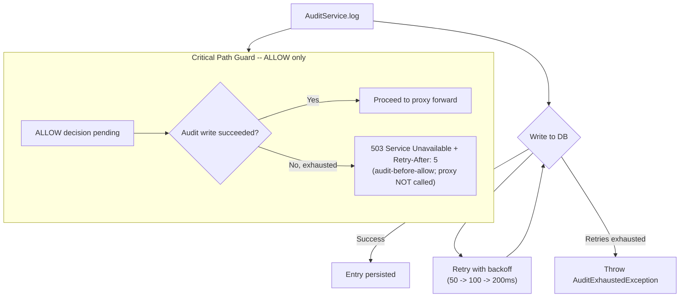

---

## 12. File structure

The as-built tree (security-relevant files; `__tests__/` and DTO dirs elided). The pipeline is implemented as a **stage-adapter pattern**: one file per stage under `gateway/pipeline/stages/`, gathered in execution order by the `PIPELINE_STAGES` factory in `gateway.module.ts` and run by `PipelineOrchestrator`. Adding a stage = one new file + one factory entry.

```
src/
├── main.ts                           (helmet -> CORS -> rate-limit, config validation, app wiring)
├── auth/
│   ├── auth.service.ts
│   ├── token-revocation.service.ts   (JTI blacklist)
│   ├── jwt-auth.guard.ts
│   ├── roles.guard.ts
│   └── roles.decorator.ts
├── gateway/
│   ├── gateway.middleware.ts
│   ├── gateway.module.ts             (PIPELINE_STAGES factory = canonical stage order)
│   └── pipeline/
│       ├── orchestrator.ts           (runs stages in order)
│       ├── pipeline-stage.ts         (PipelineStage interface + StageOutcome)
│       ├── stage-context.ts
│       ├── stage-tokens.ts
│       ├── logging/                  (stage logger decorator + detail builders)
│       └── stages/
│           ├── public-bypass.stage.ts          (1: /health, /metrics skip pipeline)
│           ├── honeypot-bypass.stage.ts        (2: decoy detection + tarpit)
│           ├── auth.stage.ts                    (3)
│           ├── revocation.stage.ts              (4)
│           ├── auth-only-shortcircuit.stage.ts  (5: control-plane, no scoring/proxy)
│           ├── trust-score.stage.ts             (6)
│           ├── hashcash.stage.ts                (7)
│           ├── policy.stage.ts                  (8)
│           ├── mfa-promotion.stage.ts           (9)
│           ├── audit-allow.stage.ts             (10: fail-closed, BEFORE proxy)
│           ├── proxy.stage.ts                   (11)
│           ├── bopla-strip.stage.ts             (12)
│           └── record-trust-context.stage.ts    (13: only on upstreamStatus < 400)
├── fingerprint/                      (NestJS pre-pipeline middleware)
│   ├── ja4h.middleware.ts            (rawHeaders -> JA4H hash)
│   ├── ja4h.util.ts
│   └── fingerprint.store.ts          (JA4H tracking + blacklist)
├── honeypot/                         (no honeypot.guard.ts — bypass stage + controller)
│   ├── honeypot.decorator.ts         (@Honeypot())
│   ├── honeypot.constants.ts         (decoy path list)
│   ├── honeypot-responses.ts         (fake tarpit payloads)
│   ├── shadow.controller.ts          (decoy endpoints)
│   └── security-metrics.service.ts
├── hashcash/                         (no hashcash.guard.ts — service + pipeline stage)
│   ├── hashcash.service.ts           (PoW challenge/verify)
│   ├── hashcash.util.ts              (SHA-256 puzzle logic)
│   ├── hashcash-metrics.ts
│   └── used-nonce-store.ts
├── policy/
│   ├── policy-evaluator.service.ts
│   ├── threat-escalation.service.ts  (sliding-window threshold tightening)
│   └── policy-admin.controller.ts
├── proxy/
│   ├── proxy.service.ts
│   ├── service-registry.service.ts
│   ├── dns-rebinding.guard.ts
│   ├── response-validator.ts
│   └── bopla.interceptor.ts          (field stripping; reads policy/field-policy.json)
├── trust-score/
│   ├── trust-score.service.ts
│   └── providers/
│       ├── behavior-anomaly.provider.ts
│       ├── trust-decay.provider.ts
│       └── ja4h-drift.provider.ts
├── mfa/                              (TOTP-based)
│   ├── mfa-challenger.service.ts
│   ├── mfa-enroller.service.ts       (TOTP enrollment)
│   ├── enrollment.store.ts
│   ├── mfa.controller.ts
│   └── repositories/
│       └── user-secrets.repository.ts
├── audit/
│   ├── audit.service.ts              (ALLOW = fail-closed WAL w/ backoff retry)
│   └── audit-exhausted.exception.ts
├── shared/
│   ├── health.controller.ts
│   ├── cert-monitor.service.ts       (mTLS cert mtime watch)
│   └── mtls.service.ts
└── metrics/
    ├── metrics.service.ts            (security-specific metrics)
    └── metrics.controller.ts

policy/                               (repo root, not under src/)
├── model.conf                        (Casbin model)
├── policy.csv                        (Casbin RBAC rules)
└── field-policy.json                 (BOPLA: path patterns -> role -> allowed fields)
```

---

## Viewing the diagrams

- **GitHub / GitLab**: Mermaid is rendered automatically in `.md` files.
- **VS Code**: Install the "Mermaid" or "Markdown Preview Mermaid Support" extension.
- **CLI**: Use [Mermaid CLI](https://github.com/mermaid-js/mermaid-cli) to export to PNG/SVG:
  ```bash
  npx mmdc -i docs/HARDENING_ARCHITECTURE.md -o docs/hardening-diagrams.pdf
  ```
- **Online**: Paste a diagram block into [mermaid.live](https://mermaid.live).

For diagram-only views, see [DIAGRAMS.md](./DIAGRAMS.md); for a narrative walkthrough of the request lifecycle, see [THESIS_PIPELINE.md](./THESIS_PIPELINE.md). For implementation details, see [CODEBASE.md](./CODEBASE.md) and [STARTUP_GUIDE.md](./STARTUP_GUIDE.md).
