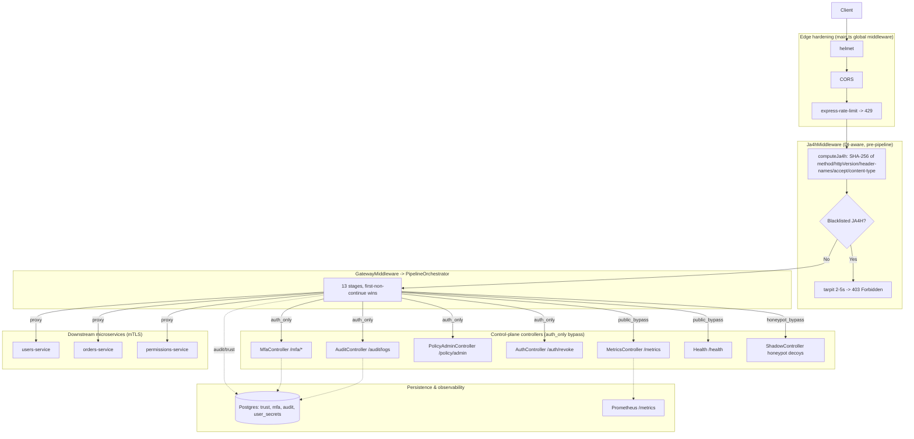
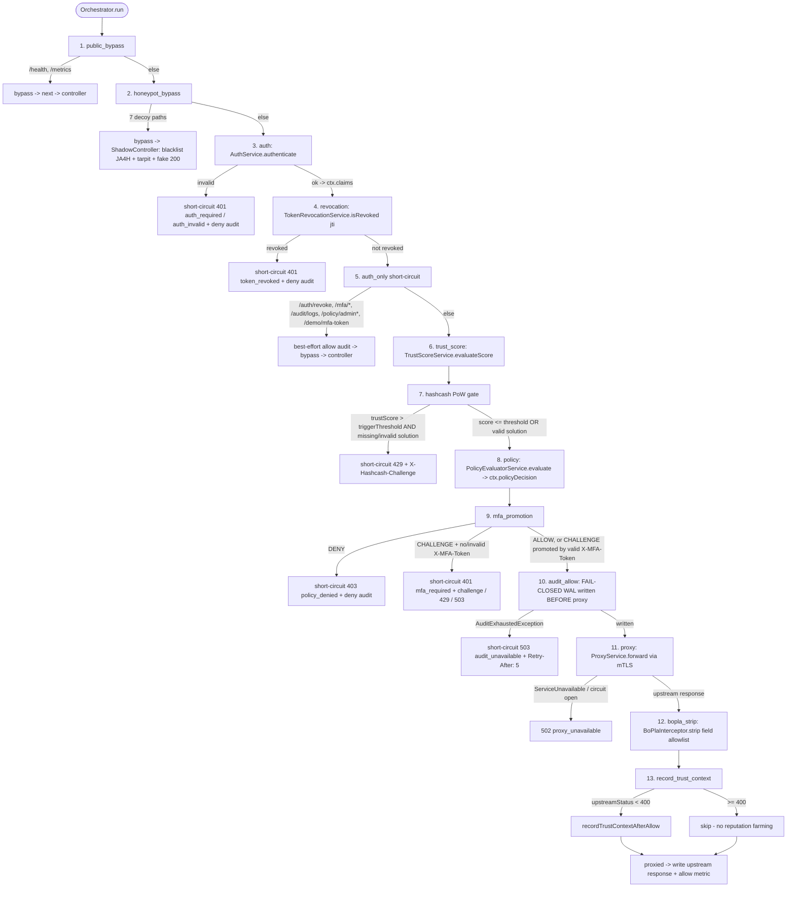
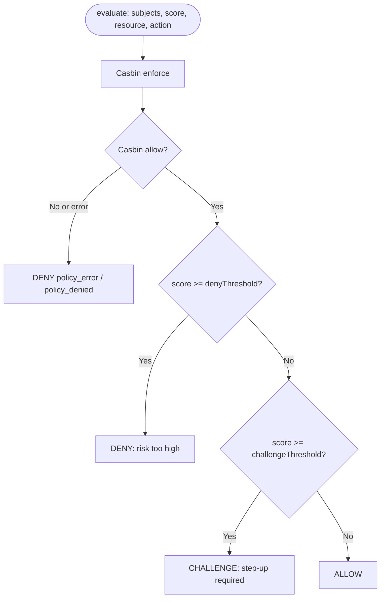

# The Request Pipeline of a Zero-Trust Access Gateway

*An explanatory companion for the master-thesis examiner.*

> **Abstract.** This document explains, end to end, how a single HTTP request is admitted, identified, scored, authorized, and forwarded by the Zero-Trust Access Gateway built in this thesis. The gateway is a NestJS application that interposes a **fixed, fail-fast pipeline** between every client and every downstream microservice. No request reaches a protected service without first being authenticated, risk-scored, and authorized; there is no implicit trust and no fast path around the checks. The body of the document walks each pipeline element in its exact execution order, and for each one answers the same five questions: *what* it does, *why* it exists, *which threat* it mitigates, *how* it works mechanically, its *key configuration*, and its *failure mode*. The intent is to make the security reasoning — not merely the code — legible to a reader who has never seen this repository.

## How to read this document

- **Per-stage template.** Every pipeline element (the pre-pipeline middleware plus the thirteen orchestrated stages) is presented with the same six labelled fields: **What / Why / Threat mitigated / How it works / Key config / Failure mode**. This makes the stages directly comparable and lets you skim for whichever dimension you care about.
- **Canonical order is load-bearing.** The stages are presented in the exact order they execute. That order is itself a design decision (see [ADR-0005](adr/0005-fixed-fail-fast-pipeline.md)): cheap rejections happen before expensive work, and later stages read context that earlier stages populate. The authoritative source for the order is the `PIPELINE_STAGES` factory in `src/gateway/gateway.module.ts`; this document mirrors it exactly.
- **"Failure mode" is the spine of the safety story.** Read those lines together and the gateway's *fail-closed* posture becomes visible: when in doubt, it denies.
- **Traceability.** Source files are cited as `src/...`. The *why* of each non-obvious decision cites an Architecture Decision Record (`docs/adr/000N`). Mechanics are cross-referenced to `docs/HARDENING_ARCHITECTURE.md`.

**Scope.** This document covers the *request pipeline* only. Out of scope: local setup and Docker (`docs/STARTUP_GUIDE.md`), database DDL, the full Casbin model, control-plane API reference, test strategy, and performance benchmarks.

---

## Table of contents

1. [Introduction & the zero-trust premise](#1-introduction--the-zero-trust-premise)
2. [Threat model](#2-threat-model)
3. [Architecture overview](#3-architecture-overview)
4. [Framing note: "10 steps" vs "13 stages"](#4-framing-note-10-steps-vs-13-stages)
5. [Edge layer: pre-pipeline middleware](#5-edge-layer-pre-pipeline-middleware)
6. [The orchestrated pipeline (13 stages)](#6-the-orchestrated-pipeline-13-stages)
7. [Cross-cutting concerns](#7-cross-cutting-concerns)
8. [Key design decisions (ADR digest)](#8-key-design-decisions-adr-digest)
9. [Limitations & future work](#9-limitations--future-work)
10. [Glossary & references](#10-glossary--references)

---

## 1. Introduction & the zero-trust premise

**Zero trust** is the security posture that *no* request is trusted by virtue of its origin — not because it came from inside the network perimeter, not because it carries a token that was valid a minute ago, not because the previous request from the same client was benign. Every request is independently verified, scored for risk, and authorized against an explicit policy before it is allowed to do anything. The perimeter dissolves; the unit of trust becomes the individual request.

The central claim of this thesis is operational: **a fixed, fail-fast pipeline can enforce that premise without exception.** Because the pipeline is non-configurable and ordered, there is no per-route shortcut and no way to reach a downstream service while skipping authentication, scoring, or authorization. The order is part of the security argument, not an implementation accident.

**Technology context (one line each).** The gateway is built on **NestJS** / **TypeScript**. Persistent state lives in **PostgreSQL**, accessed through the raw `pg` driver rather than an ORM ([ADR-0011](adr/0011-raw-pg-no-orm.md)) so that every query and its failure semantics are explicit. Authorization uses the **Casbin** RBAC engine. JWT verification uses **jose**, supporting HS256, RS256, and ES256. For the canonical domain vocabulary, see [`CONTEXT.md`](../CONTEXT.md); for project orientation, [`CLAUDE.md`](../CLAUDE.md).

---

## 2. Threat model

The pipeline is organized around a concrete catalogue of threats. Each "Threat mitigated" line in Section 6 refers back to one of these classes:

| # | Threat class | One-line description |
|---|---|---|
| T1 | Bot / scanner reconnaissance | Automated probing for known-vulnerable paths and stacks. |
| T2 | Automated credential abuse | Scripted requests with forged, malformed, or `alg:none` tokens. |
| T3 | Token replay / stale tokens | A valid JWT used after logout or compromise, before natural expiry. |
| T4 | Session / device hijack | A captured token replayed from a different device or network. |
| T5 | Behavioural anomaly | Access at unusual times or rates inconsistent with the user's history. |
| T6 | Brute-force / volumetric DoS | High-frequency automated traffic intended to overwhelm or guess. |
| T7 | Privilege misuse (RBAC) | An authenticated principal acting beyond its granted role. |
| T8 | MFA bypass | Attempting to escape a step-up challenge without completing it. |
| T9 | SSRF / DNS rebinding / metadata exfiltration | Steering the gateway's outbound call to an internal or metadata target. |
| T10 | BOPLA over-exposure | Downstream returning object properties the caller is not authorized to see. |
| T11 | Audit gaps | Access that occurs but is never recorded — blind spots in the trail. |
| T12 | Reputation farming | Manufacturing favourable trust history to lower future risk scores. |

**A stated boundary.** Version 1 targets a *single instance* ([ADR-0012](adr/0012-stateless-single-instance-design.md)). Some defences rely on per-process state (the JTI revocation list, the hashcash replay store, the fingerprint blacklist, threat-escalation counters). Against an attacker who can distribute load across multiple gateway instances, those specific defences are not yet shared. This is an explicit, accepted limitation of the threat model, revisited in Section 9.

---

## 3. Architecture overview

A request traverses three conceptual layers:

1. **Edge layer (pre-pipeline).** Express/NestJS middleware applied in `src/main.ts` (Helmet, CORS, rate limiting) and the `Ja4hMiddleware` (`src/fingerprint/`). These run *before* the zero-trust pipeline and can reject obviously hostile traffic at the door.
2. **The orchestrated pipeline.** `PipelineOrchestrator.run` (`src/gateway/pipeline/orchestrator.ts`) executes **13 stages** in a fixed order. Each stage either passes context forward, short-circuits with a terminal response (deny / challenge / bypass), or both.
3. **Cross-cutting concerns.** Prometheus security metrics and an `EventEmitter2` bus run *alongside* the pipeline rather than as a step in it, so that modules can react to events (e.g. threat escalation) without circular dependencies.

**The fail-fast principle ([ADR-0005](adr/0005-fixed-fail-fast-pipeline.md)).** The order is fixed and non-configurable. Cheap, certain rejections (blacklisted fingerprint, honeypot hit) happen before expensive work (database-backed trust scoring, Casbin evaluation, proxying). Later stages depend on context populated by earlier ones — policy reads the trust score; the audit-before-allow gate fires only after a decision exists. Making the order configurable would invite ordering bugs that silently break these invariants (auditing before a decision exists, or scoring an unauthenticated request), so the order is encoded once in the `PIPELINE_STAGES` factory and treated as a tested invariant.

The following diagram shows the high-level split between the control plane (the gateway's own endpoints) and the data plane (proxied traffic).



*(Diagram adapted from [`docs/DIAGRAMS.md`](DIAGRAMS.md), §1 "System overview".)*

---

## 4. Framing note: "10 steps" vs "13 stages"

The project's headline describes a **"10-step pipeline."** That figure is an honest *conceptual* grouping intended for a reader's mental model; the *implementation* orchestrates **13 stages** (plus one pre-pipeline fingerprint middleware and the edge-hardening middleware in `src/main.ts`). No enumerated, authoritative list of exactly which ten steps was located in the repository, so this document treats the **13 stages of `PIPELINE_STAGES` as the authoritative set** and presents "10" as an approximate headline count. The table below reconciles the two views and marks which implementation stages are *folded* into a conceptual step versus genuinely separate.

| Conceptual step (the "10") | Implementation stage(s) / middleware | Stage ID(s) | Notes |
|---|---|---|---|
| 1. JA4H fingerprinting | `Ja4hMiddleware` | *(pre-pipeline)* | Runs before the orchestrator; not a `PIPELINE_STAGES` entry. |
| 2. Honeypot detection | Honeypot bypass | `honeypot_bypass` | `public_bypass` folded in as benign routing for `/health`, `/metrics`. |
| 3. Authentication | Auth | `auth` | — |
| 4. Token revocation check | Revocation | `revocation` | Separate stage; kills valid JWTs before expiry. |
| 5. Trust scoring (7 signals) | Trust score | `trust_score` | `auth_only` folded in as the control-plane bypass branch. |
| 6. Hashcash proof-of-work | Hashcash | `hashcash` | Conditional — only above the trust threshold. |
| 7. Policy evaluation | Policy | `policy` | Casbin RBAC + dynamic risk thresholds. |
| 8. MFA challenge | MFA promotion | `mfa_promotion` | Branches on the policy decision. |
| 9. mTLS proxy forwarding | Proxy | `proxy` | `audit_allow` folded in as the pre-proxy WAL gate. |
| 10. BOPLA response stripping | BOPLA strip | `bopla_strip` | `record_trust_context` noted as post-proxy bookkeeping. |

So the "13" expands the "10" by surfacing three stages that the headline folds away: `public_bypass` (routing), `auth_only` (control-plane short-circuit), and `audit_allow` / `record_trust_context` (the audit gate and the trust-history write). These are exactly the stages whose security significance is easy to miss — which is why this document gives each its own section.

---

## 5. Edge layer: pre-pipeline middleware

These run as Express/NestJS middleware *before* the orchestrated pipeline.

### 5.0 Bootstrap hardening — `src/main.ts`

**What** — Applies HTTP security headers (Helmet), CORS, and IP-based rate limiting to every response, before any zero-trust logic runs.

**Why** — Defence in depth at the transport edge: standard hardening that should apply uniformly and unconditionally. The *ordering* is the design point — Helmet first (so headers apply to every response, including errors), then CORS, then rate limiting. CORS is deliberately placed **before** rate limiting so that a browser's `OPTIONS` preflight is not consumed by the throttle budget (the bootstrap code annotates this as `D-06 / BOOT-04`).

**Threat mitigated** — T6 (volumetric DoS / brute force) via the rate limiter; generic header-based browser attacks via Helmet.

**How it works** — In `src/main.ts` (roughly lines 39–55) the bootstrap sequence is: `app.use(helmet())` → `app.enableCors({ origin: corsOrigin })` → `app.use(rateLimit({ windowMs, max, standardHeaders: true, legacyHeaders: false }))`. A `x-request-id` correlation middleware and the global exception filter follow. *(Note: `CLAUDE.md` refers to a `src/bootstrap-app.ts`; that reference is stale — the live location is `src/main.ts`.)*

**Key config** —
- `RATE_LIMIT_WINDOW_MS` → window length for the throttle → bootstrap default.
- `RATE_LIMIT_MAX` → max requests per window per IP → bootstrap default.
- `CORS_ORIGIN` → allowed CORS origin(s).

**Failure mode** — Rate-limit exceeded → **429 Too Many Requests** (with standard `RateLimit-*` headers). Fail-closed for the offending IP within the window.

### 5.1 `Ja4hMiddleware` — JA4H fingerprinting — `src/fingerprint/`

**What** — Computes a **JA4H HTTP fingerprint** for the request, attaches it as the `x-ja4h` header for downstream stages, and rejects requests whose fingerprint is blacklisted.

**Why** — A fingerprint is a far more stable enforcement key than an IP address. Botnets and abusive clients rotate IPs cheaply but keep a characteristic HTTP signature. Using the *fingerprint* as the enforcement key lets a ban survive IP rotation.

**Threat mitigated** — T1 (bot/scanner reconnaissance), T6 (automated abuse) — by keying enforcement to a property the attacker cannot trivially change.

**How it works** — The fingerprint is the SHA-256 of `method | httpVersion | orderedHeaderNames | accept | content-type`. Header *names* are read from `rawHeaders` to preserve their original casing and order, which is itself signal (libraries and browsers emit headers in characteristic orders). If the computed fingerprint is on the blacklist, the middleware applies a **tarpit** — a randomized 2–5 second sleep — and then returns a generic **403**. The tarpit imposes cost on the attacker and denies them a fast signal about *why* they were blocked.

**Key config** — Fingerprint composition is fixed in code; blacklist membership is populated at runtime (notably by the honeypot stage, §6.2).

**Failure mode** — Blacklisted fingerprint → tarpit, then **403 Forbidden** (generic, non-informative). Fail-closed.

---

## 6. The orchestrated pipeline (13 stages)

The stages below appear in the exact order of the `PIPELINE_STAGES` factory in `src/gateway/gateway.module.ts`. The full decision flow is shown first, then each stage in detail.



*(Diagram adapted from [`docs/DIAGRAMS.md`](DIAGRAMS.md), §2 "The 13-stage data-plane pipeline".)*

### 1. `public_bypass` — Public-path bypass

**What** — Lets `/health` and `/metrics` skip the entire zero-trust pipeline.

**Why** — These endpoints carry no user data and must be reachable by liveness probes and Prometheus scrapers that hold no JWT. Forcing them through auth would break observability and orchestration health checks.

**Threat mitigated** — None directly; it is a *correctness* exception. It is placed first and kept deliberately tiny (an exact-path allowlist) so it cannot be widened into an accidental authentication bypass.

**How it works** — On an exact match for a public path, the stage returns a bypass result and the orchestrator stops — no auth, no scoring, no audit.

**Key config** — Public path set is fixed in code.

**Failure mode** — N/A (only matches a closed allowlist of safe paths). Non-matching requests fall through to the next stage.

### 2. `honeypot_bypass` — Honeypot decoys

**What** — Routes requests for seven decoy paths to a `ShadowController` that returns a realistic fake response while quietly flagging the caller as malicious.

**Why** — Any request to a path that does not legitimately exist (`/wp-login.php`, `/.env`, `/admin/config.json`, `/api/v1/debug`, `/graphql/introspection`, `/actuator/health`, `/api/v1/internal/keys`) is, by construction, reconnaissance or attack — a legitimate client has no reason to ask for them.

**Threat mitigated** — T1 (bot/scanner reconnaissance). Crucially it converts a probe into an enforcement signal.

**How it works** — On a honeypot hit the `ShadowController` (a) **blacklists the caller's JA4H fingerprint as TERMINAL**, (b) increments a honeypot counter, (c) emits a `HONEYPOT_TRIGGER` threat event, (d) writes a deny audit, (e) tarpits, and (f) returns a realistic fake response so the attacker cannot easily tell they were detected. The terminal blacklist is the sharp edge: the *next* request from that fingerprint will be scored **1.0** by the trust stage (see §6.6), guaranteeing denial.

**Key config** — Honeypot path set is fixed in code (statically imported, deliberately, to avoid a DI cycle — see the module comment in `src/gateway/gateway.module.ts`).

**Failure mode** — Always a terminal handling of a known-malicious request (fake **200**-shaped response after tarpit, with the side effects above). Fail-closed by escalation.

### 3. `auth` — Authentication

**What** — Extracts and verifies the Bearer JWT and produces a typed `UserClaims` object for the rest of the pipeline.

**Why** — Identity is the precondition for every later decision. Verification is *algorithm-routed* ([ADR-0010](adr/0010-algorithm-routed-jwks.md)) so that the verification path is selected by the token's declared algorithm against a hard-pinned allowlist, closing algorithm-confusion attacks.

**Threat mitigated** — T2 (credential abuse), and the classic `alg:none` / algorithm-confusion forgery.

**How it works** — `AuthService.authenticate` (`src/auth/`) extracts the Bearer token, decodes the header, and routes: `HS256` → symmetric verification with `JWT_SECRET`; `RS256`/`ES256` → asymmetric verification using a local SPKI public key (`JWT_PUBLIC_KEY`) or a lazily-cached remote JWKS. Algorithms are hard-pinned to `[HS256, RS256, ES256]`; `alg:none` is rejected; a token with `typ:mfa` is rejected as an access token (MFA tokens are a different credential, §6.9). The claims `jti` and `sub` are required; issuer/audience are optionally enforced. Output: `UserClaims { userId, roles[], jti, exp, deviceId }` (plus optional `email` and `sessionId`).

**Key config** —
- `JWT_SECRET` → HMAC secret for HS256.
- `JWT_PUBLIC_KEY` → SPKI public key for RS256/ES256.
- `JWKS_URI` → remote JWKS endpoint (optional, lazily cached).
- Optional `JWT_ISSUER` / `JWT_AUDIENCE`.

**Failure mode** — Missing/invalid token → **401 Unauthorized**, plus a deny audit and an `AUTH_INVALID_TOKEN` threat event. Fail-closed.

### 4. `revocation` — Token revocation check

**What** — Rejects an otherwise-valid JWT whose `jti` has been revoked.

**Why** — JWTs are valid until they expire; logout or compromise must take effect *immediately*, not whenever the token happens to expire. A revocation list bridges that gap.

**Threat mitigated** — T3 (stale-token / post-logout / post-compromise replay).

**How it works** — `TokenRevocationService.isRevoked(jti)` (`src/auth/`) checks an in-memory JTI blacklist. Entries are evicted lazily and auto-expire at the token's own `exp`, so the list cannot grow without bound — a revoked token only needs to be remembered until it would have expired anyway.

**Key config** — Populated at runtime via the revoke control-plane endpoint (`/auth/revoke`); no static configuration.

**Failure mode** — Revoked `jti` → **401 token_revoked**. Fail-closed. *(Per-instance state — see [ADR-0012](adr/0012-stateless-single-instance-design.md) and Section 9.)*

### 5. `auth_only` — Control-plane short-circuit

**What** — Recognizes the gateway's *own* control-plane paths, marks them authenticated, writes an allow audit, and hands them to their NestJS controller — without trust-scoring or proxying them.

**Why** — Paths such as `/auth/revoke`, `/mfa/*`, `/audit/logs`, `/policy/admin*`, and `/demo/mfa-token` *are* the gateway; there is no downstream service to proxy them to. Most importantly, **`/mfa/verify` must reach its controller** so that a user currently in the CHALLENGE state can complete MFA and escape it. Routing `/mfa/verify` through the data plane would deadlock the challenged user — they would need MFA to obtain MFA.

**Threat mitigated** — A self-inflicted **availability deadlock** (a variant of T8 mitigation correctness): without this stage, step-up would be unescapable.

**How it works** — On a control-plane path match, the stage writes an allow audit and bypasses to the NestJS controller layer (which still applies `JwtAuthGuard` / `RolesGuard`). Control-plane endpoints are authenticated but not risk-scored or proxied.

**Key config** — Control-plane path set fixed in code.

**Failure mode** — N/A as a decision point; it is a routing short-circuit for already-authenticated callers. The controllers themselves enforce role guards.

### 6. `trust_score` — Continuous trust scoring (7 signals)

**What** — Computes a continuous risk score in `[0.0, 1.0]` from seven contextual signals. This is the heart of the zero-trust model: risk is *continuous and contextual*, not a binary "logged-in or not."

**Why** — Authentication answers "who"; the trust score answers "how risky is *this* request, *right now*." It feeds the policy stage so that the same identity can be allowed, challenged, or denied depending on circumstances.

**Threat mitigated** — T4 (device/session hijack), T5 (behavioural anomaly), T1/T6 (via the terminal-blacklist short-circuit).

**How it works** — `TrustScoreService.evaluateScore` (`src/trust-score/`) builds a `TrustContext { userId, deviceId, ip, ja4h }` and runs the following signals (rules and providers run in parallel). The final score is `score = clamp(0, 1, 0.5 + Σ deltas)`. Base **0.5** is *neutral* — no evidence either way. A higher score means *more risk*. See `docs/HARDENING_ARCHITECTURE.md` §3.

| # | Signal | Direction / range | Meaning |
|---|---|---|---|
| 1 | Terminal JA4H blacklist | → forces **1.0** (terminal) | Fingerprint previously tripped a honeypot; returns 1.0 immediately, no DB read. |
| 2 | Device reputation | known **−0.15** / unknown **+0.15** | Recognized device lowers risk. |
| 3 | IP reputation | trusted **−0.15** / else **+0.15** | Known-good network lowers risk. |
| 4 | Request frequency | burst **+0.2** / normal **−0.1** | Sudden volume raises risk. |
| 5 | JA4H drift | differs **+0.3** / stable **−0.05** | Stored fingerprint changed → high-confidence hijack signal; emits `FINGERPRINT_DRIFT_DETECTED`. |
| 6 | Behaviour anomaly | clamped **[0, 0.4]** | Hour-of-day + rate z-scores, gated by a warm-up period. |
| 7 | Trust decay | multiplier `k = exp(−idleMs / halfLife)` | Attenuates *favourable* decayable deltas as the account sits idle. |

Two nuances worth noting for the defence:

- **Trust decay is gradual, not a switch.** The configuration parameter is named `decayHalfLifeMs`, but the formula `k = exp(−idleMs / decayHalfLifeMs)` actually treats it as an exponential *time constant* τ rather than a true half-life: at idle equal to τ the decay factor is `e^(−1) ≈ 0.368`, not 0.5. Favourable history therefore fades smoothly rather than abruptly. Decay only attenuates *favourable* deltas, so idleness never *lowers* perceived risk.
- **Conservative bias on fault.** If any signal provider throws, the error is caught, a `TRUST_PROVIDER_FAULT` event is emitted, and a **+0.1** bias is applied. The system errs toward *more* risk when it cannot measure — fail-closed in spirit even within a probabilistic stage.

**Key config** —
- `POLICY_CHALLENGE_RISK_THRESHOLD` / `POLICY_DENY_RISK_THRESHOLD` → consumed downstream by policy (§6.8), not here.
- Decay half-life and per-signal weights are configured in the trust-score slice.

**Failure mode** — Individual signal fault → caught, `+0.1` conservative bias, continue. There is no "trust failed" terminal here; the score always resolves and is handed to policy.

### 7. `hashcash` — Proof-of-work for high-risk requests

**What** — Demands a client-side **proof-of-work** (hashcash) when, and only when, the trust score exceeds a trigger threshold. The difficulty scales with the risk.

**Why** — Proof-of-work imposes an *asymmetric* compute cost: negligible for a legitimate client making one request, expensive for an automated client making thousands. It is stateless on the hot path by design ([ADR-0007](adr/0007-stateless-hashcash-nonce.md)).

**Threat mitigated** — T6 (volumetric DoS, automated abuse, brute force) targeted specifically at clients the gateway already considers risky.

**How it works** — PoW is enforced when `trustScore > triggerThreshold` (strict greater-than, [ADR-0008](adr/0008-opossum-wraps-full-retry-loop.md) family). The client must present `X-Hashcash-Nonce` and `X-Hashcash-Solution`. Verification is a deliberately ordered gauntlet (`src/hashcash/`): length bound → structural parse → **constant-time HMAC** check (`timingSafeEqual`) → payload shape → **identity binding** (the nonce's `sub`/`dev` must match the caller) → expiry → **difficulty re-derived against the live score** → replay check against an in-memory `UsedNonceStore` → leading-zero-bits check. Difficulty in bits is:

```
bits = clamp( round( min + (score − 0.7) × (max − min) / 0.2 ), min, max )
```

with anchors `0.7 → 18`, `0.8 → 20`, `0.9 → 22` (defaults `min = 18`, `max = 22`). Re-deriving difficulty against the *live* score, combined with identity binding and the used-nonce store, closes replay: an old solution computed at lower difficulty no longer satisfies a now-higher requirement.

**A note on the threshold (0.7 vs 0.5).** The *operative* trigger threshold is **0.7** — set by the config schema (`HASHCASH_TRIGGER_THRESHOLD`, Joi default `0.7`), by `.env.example`, and documented in the hashcash config slice. The `0.5` that appears in the stage code (`this.cfg.triggerThreshold ?? 0.5`) is purely a **defensive in-code fallback** reached only if configuration is entirely absent — a state that never occurs in a configured runtime (a few unit tests pin it deliberately to exercise that branch). It is a safety default, not a contradiction.

**Key config** —
- `HASHCASH_TRIGGER_THRESHOLD` → score above which PoW is required → **0.7**.
- Difficulty `min` / `max` bits → **18 / 22**.
- HMAC nonce secret → for stateless challenge signing.

**Failure mode** — Missing or invalid proof → a fresh challenge is issued: **429 Too Many Requests** with `X-Hashcash-Challenge` and `Retry-After: 1`. Fail-closed (the request is not served until the work is done).

### 8. `policy` — Casbin authorization + dynamic risk thresholds

**What** — Combines RBAC authorization (Casbin) with the risk score to produce one of three decisions: **ALLOW / CHALLENGE / DENY**.

**Why** — Authorization must be explicit and **fail-closed** ([ADR-0004](adr/0004-casbin-fails-closed.md)): any error in the policy engine results in DENY, never an accidental ALLOW. Risk thresholds are *dynamic*, tightening as system-wide threat rises.

**Threat mitigated** — T7 (privilege misuse / RBAC), and elevated-threat scenarios via dynamic thresholds.

**How it works** — `PolicyStage` → `PolicyEvaluatorService.evaluate` (`src/policy/`). It builds subjects `user:<id>` and `role:<role>` and calls Casbin `enforce(sub, obj, act)`. If Casbin produces no match → **DENY**. Otherwise it maps the trust score against thresholds pulled **live** from `ThreatEscalationService`: `score ≥ denyThreshold` → **DENY**; `score < challengeThreshold` → **ALLOW**; otherwise → **CHALLENGE**. Any Casbin error → **DENY policy_error** (never falls through to ALLOW). A DENY emits `POLICY_DENY`. The decision logic is shown below.



*(Diagram adapted from [`docs/DIAGRAMS.md`](DIAGRAMS.md), §6 "Policy evaluation".)*

**Dynamic thresholds.** `ThreatEscalationService` maintains a system-wide threat level (**Normal / Elevated / Critical**) from a sliding window of signals (denies, invalid tokens, honeypot hits, MFA rate-limits). As threat rises, the deny and challenge thresholds *tighten*, so the same trust score that was ALLOWed under Normal may be CHALLENGEd or DENYed under Critical.

**Key config** —
- `POLICY_CHALLENGE_RISK_THRESHOLD` → base CHALLENGE boundary → 0.5.
- `POLICY_DENY_RISK_THRESHOLD` → base DENY boundary → 0.8.
- Casbin model/policy → `policy/model.conf`, `policy/policy.csv`.

**Failure mode** — Any Casbin error or no-match → **DENY** (403 downstream). Fail-closed by construction.

### 9. `mfa_promotion` — Step-up authentication

**What** — Acts on the policy decision: ALLOW passes through; DENY is rejected; CHALLENGE is *promoted* to ALLOW if a valid MFA token is present, otherwise a challenge is issued. The motto is *"step up, don't deny."*

**Why** — A CHALLENGE is a chance to *recover* trust, not a hard refusal. A risky-but-legitimate user can prove themselves via MFA rather than being turned away. The MFA token is a *separate* JWT signed with its own secret ([ADR-0006](adr/0006-separate-mfa-jwt-secret.md)) to isolate blast radius, and it is bound to the device/network ([ADR-0003](adr/0003-mfa-token-fingerprint-binding.md)) so it cannot be replayed elsewhere.

**Threat mitigated** — T8 (MFA bypass) and T4 (hijack — via fingerprint binding).

**How it works** — `MfaPromotionStage` (`src/mfa/`) branches:

- **ALLOW** → continue to the audit gate.
- **DENY** → **403 policy_denied** + deny audit.
- **CHALLENGE** → if `X-MFA-Token` is valid, promote to ALLOW (`incrementMfaPromotion`); else create a challenge and return **401 mfa_required** (with `WWW-Authenticate` and `X-MFA-Challenge` headers), or **429 mfa_rate_limited** / **503 mfa_internal** on those conditions.

The MFA token is validated as: signature (with `MFA_JWT_SECRET`) → `typ:mfa` → atomic `jti` lookup → **fingerprint match** `SHA-256(userId | deviceId | ip)`. The fingerprint binding is what prevents a stolen MFA token from being replayed from another device or network.

**Key config** —
- `MFA_JWT_SECRET` → signing secret for MFA tokens (distinct from `JWT_SECRET`).
- MFA challenge rate-limit window / max → per-user throttle.

**Failure mode** — Unsatisfied challenge → **401 mfa_required**; rate-limited → **429**; internal error → **503**; explicit DENY → **403**. Fail-closed.

### 10. `audit_allow` — Fail-closed audit write-ahead log

**What** — Writes the ALLOW audit record **before** the request is proxied, and *blocks* the request until that write durably succeeds.

**Why** — This inverts the usual "log asynchronously, never block the request" pattern ([ADR-0001](adr/0001-audit-before-allow-wal.md)). For a zero-trust gateway the audit trail is a hard security requirement, not best-effort telemetry: there must be **no unaudited ALLOW**. So an ALLOW is held until it is recorded.

**Threat mitigated** — T11 (audit gaps / blind spots). An audit-store outage degrades the gateway to *denial*, never to unrecorded access.

**How it works** — `writeBlocking` runs a retry loop with exponential backoff (base 50 ms, doubling; 3 attempts, so sleeps of 50 ms then 100 ms between tries). If the retries are exhausted it **throws** `AuditExhaustedException`, which surfaces as **503 audit_unavailable** with `Retry-After: 5`. By contrast, CHALLENGE and DENY audits remain best-effort and never throw — the asymmetry is intentional: the dangerous case to lose is a *granted* access. See `docs/HARDENING_ARCHITECTURE.md` §11.

**Key config** — Retry backoff schedule is fixed in code; `DATABASE_URL` for the audit store.

**Failure mode** — WAL exhaustion → **503 audit_unavailable** + `Retry-After: 5`. Fail-closed (denies rather than serves unaudited).

### 11. `proxy` — mTLS forwarding with SSRF defence-in-depth

**What** — Forwards the now-authorized request to the correct downstream microservice over mutual TLS, with layered SSRF protection and resilience (circuit breaker + retries).

**Why** — The gateway makes an *outbound* call on behalf of a client; that is exactly the capability an SSRF attacker wants to hijack. The defences are layered so that no single bypass is sufficient. Target selection never trusts client-supplied host headers ([ADR-0009](adr/0009-path-prefix-service-routing.md)); the circuit breaker wraps the *full* retry loop, not each attempt ([ADR-0008](adr/0008-opossum-wraps-full-retry-loop.md)).

**Threat mitigated** — T9 (SSRF / DNS rebinding / cloud-metadata exfiltration), plus downstream outages cascading back to the gateway.

**How it works** — `ProxyService.forward` (`src/proxy/`):

1. **Path-prefix routing.** The target service name is the *first path segment*, resolved against the `ServiceRegistryService` allowlist. The target is **never** derived from the `Host` or any client header.
2. **DNS-rebinding guard.** The hostname is resolved fresh (no cache), and loopback (`127.0.0.0/8`, `::1`) and the cloud-metadata address `169.254.169.254` are blocked. RFC1918 private ranges are *intentionally allowed* because Docker/Kubernetes service networking needs them.
3. **mTLS.** `MtlsService` provides an `https.Agent` cached by file `mtime` (so cert rotation is picked up without restart) and validates the server's CN against an allowlist.
4. **Resilience.** A per-service opossum **circuit breaker** wraps the entire retry loop (one breaker "fire" per request; a single failure recorded only after *all* retries are exhausted, so transient blips don't trip the breaker prematurely). Retries fire on `ECONNREFUSED` / `ETIMEDOUT` / `ECONNRESET` and on `502/503/504`, with backoff `[100, 200, 400] ms`.
5. **Header hygiene.** Strips `authorization`, `cookie`, `x-forwarded-for`, `host`, `content-length`, and any incoming `x-gateway-*`; injects `x-user-id`, `x-roles`, `x-trust-score`, `x-gateway-request`, `x-ja4h`.

**Key config** —
- `PROXY_SERVICE_REGISTRY` → JSON map `serviceName → baseUrl` (the SSRF allowlist).
- `MTLS_CA_CERT_PATH` / `MTLS_CLIENT_CERT_PATH` / `MTLS_CLIENT_KEY_PATH` → mTLS certs.
- `MTLS_ALLOWED_SUBJECTS` → CN allowlist for server certs.

**Failure mode** — Breaker open or all retries exhausted → **502 proxy_unavailable**. Unknown/unallowlisted service → rejected. Fail-closed.

### 12. `bopla_strip` — Response field-level authorization

**What** — Strips object properties from the downstream *response* that the caller's role is not authorized to see, at the edge.

**Why** — Defence against **BOPLA** (Broken Object Property Level Authorization, OWASP API3:2023). A downstream service may over-return fields (`ssn`, `salary`, internal flags); the gateway enforces field-level authorization even if the service does not. It is **fail-closed**: an unmatched role/pattern yields an *empty* object rather than leaking.

**Threat mitigated** — T10 (BOPLA over-exposure / sensitive-field leakage).

**How it works** — `BoPlaInterceptor.strip(body, path, roles)` (`src/proxy/` / interceptor) applies a JSON, role-keyed **allowlist** policy: micromatch path patterns, first-match-wins, per caller role. It recursively walks objects and arrays. With no matching pattern/role the result is `{}` (empty) — the secure default. Admin roles are always allowed through.

**Key config** — Field allowlist policy (JSON, path patterns per role).

**Failure mode** — No matching allowlist entry → `{}` returned (fields stripped). Fail-closed by default.

### 13. `record_trust_context` — Post-allow trust-history write

**What** — Persists the request's trust/reputation context to history — but only after the request reached ALLOW *and* the proxy returned success (`upstreamStatus < 400`).

**Why** — This is the **CHALLENGE-bypass safety invariant** ([ADR-0002](adr/0002-trust-signals-persisted-only-on-allow.md)). If history were recorded on CHALLENGE or DENY, an attacker could **farm reputation**: deliberately trigger challenges they never complete, manufacturing favourable history that lowers their future trust score. Recording only on a *completed, successful* ALLOW makes reputation reflect genuine authorized use.

**Threat mitigated** — T12 (reputation farming).

**How it works** — `recordTrustContextAfterAllow` (`src/trust-score/`) writes device/IP/fingerprint reputation history. It runs last, conditionally, and never on CHALLENGE or DENY paths.

**Key config** — `DATABASE_URL` for the trust store; no behavioural toggles.

**Failure mode** — Best-effort post-success bookkeeping; a write failure here does not retroactively un-serve the already-completed request. It is gated *not* to fire on non-ALLOW outcomes — the safety property is in *when* it runs, not in error handling.

---

## 7. Cross-cutting concerns

These run *alongside* the pipeline, not as a step in it.

### Prometheus security metrics

`MetricsService` (`src/metrics/`) merges several registries on each `/metrics` scrape: its own registry plus `SecurityMetrics`, `HashcashMetrics`, and `PolicyMetrics`. Notable series:

- `zt_gateway_requests_total{decision}` — outcome counts by ALLOW/CHALLENGE/DENY.
- `zt_gateway_stage_duration_seconds{stage}` — per-stage latency histogram (validates the fail-fast cost ordering empirically).
- `zt_gateway_audit_wal_duration_seconds`, `zt_gateway_audit_failures_total` — health of the audit-before-allow gate.
- `zt_gateway_mfa_promotions_total{result}`, `zt_gateway_token_revocations_total`.
- `zt_gateway_ja4h_blacklist_size`, `zt_gateway_fingerprint_drift_total`, `zt_gateway_trust_provider_fault_total{provider}`.
- Threat-level gauge and transition counters.

### The event bus (decoupling)

Cross-module updates (a honeypot hit incrementing a counter, a drift event raising threat level) flow over an **`EventEmitter2`** bus rather than direct calls. This avoids circular dependencies between, e.g., the honeypot stage, the metrics module, and the threat-escalation service, and keeps the pipeline stages thin.

### Audit semantics, restated

The audit story has two halves and the contrast is deliberate: `audit_allow` is a **fail-closed WAL** ([ADR-0001](adr/0001-audit-before-allow-wal.md)) — an ALLOW is blocked until durably logged — whereas CHALLENGE and DENY audits are **best-effort** and never throw into the request path. The asymmetry follows from the threat: the costly record to lose is the one for *granted* access.

### Dynamic threat escalation

`ThreatEscalationService` maintains a system-wide level (Normal / Elevated / Critical) from a sliding window of security signals and feeds *live* thresholds into the policy stage (§6.8). This is how the gateway becomes *more* suspicious under attack without any human reconfiguration.

---

## 8. Key design decisions (ADR digest)

| ADR | Decision | One-line rationale | Stage(s) governed |
|---|---|---|---|
| [0001](adr/0001-audit-before-allow-wal.md) | Audit before allow (WAL) | No unaudited ALLOW; audit outage → deny, not silent access. | `audit_allow` |
| [0002](adr/0002-trust-signals-persisted-only-on-allow.md) | Trust history only on ALLOW | Prevents reputation farming via uncompleted challenges. | `record_trust_context` |
| [0003](adr/0003-mfa-token-fingerprint-binding.md) | MFA token fingerprint binding | Binds MFA token to `SHA-256(user\|device\|ip)`; blocks cross-device replay. | `mfa_promotion` |
| [0004](adr/0004-casbin-fails-closed.md) | Casbin fails closed | Any policy-engine error → DENY, never accidental ALLOW. | `policy` |
| [0005](adr/0005-fixed-fail-fast-pipeline.md) | Fixed fail-fast pipeline | Order is load-bearing; cheap rejections first, no reordering. | all |
| [0006](adr/0006-separate-mfa-jwt-secret.md) | Separate MFA JWT secret | Isolates blast radius from the access-token secret. | `auth`, `mfa_promotion` |
| [0007](adr/0007-stateless-hashcash-nonce.md) | Stateless HMAC hashcash | No DB on the hot path; challenge is a signed nonce. | `hashcash` |
| [0008](adr/0008-opossum-wraps-full-retry-loop.md) | Breaker wraps full retry loop | One failure recorded only after all retries; no premature trips. | `proxy` |
| [0009](adr/0009-path-prefix-service-routing.md) | Path-prefix + registry routing | Target from path segment + allowlist, never client headers (SSRF). | `proxy` |
| [0010](adr/0010-algorithm-routed-jwks.md) | Algorithm-routed JWT | Verification path pinned by declared alg; kills alg-confusion. | `auth` |
| [0011](adr/0011-raw-pg-no-orm.md) | Raw `pg`, no ORM | Explicit queries and failure semantics for security-critical state. | persistence (all DB stages) |
| [0012](adr/0012-stateless-single-instance-design.md) | Stateless single-instance v1 | No server sessions; some per-instance state accepted for v1. | `revocation`, `hashcash`, threat escalation |

The full set, including [0013 (deliberate scope boundaries)](adr/0013-deliberate-scope-boundaries.md), lives in [`docs/adr/`](adr/).

---

## 9. Limitations & future work

The most important limitation is architectural and is stated openly in [ADR-0012](adr/0012-stateless-single-instance-design.md): **v1 targets a single instance.** Identity is carried entirely by stateless JWTs, and the only *shared* persistent state lives in Postgres. But several defences hold **per-process** state:

- the **in-memory JTI revocation list** (§6.4),
- the **hashcash used-nonce replay store** (§6.7),
- the **JA4H fingerprint blacklist** (§5.1, §6.2),
- the **threat-escalation counters** (§6.8),
- the **circuit-breaker** and **rate-limiter** state (§6.11, §5.0).

The implication for a horizontally-scaled deployment is direct: an attacker who can spread requests across multiple gateway instances could, for example, replay a hashcash nonce against an instance that has not yet seen it, or evade a fingerprint ban that only one instance recorded. Closing this requires **externalizing that state** into a shared tier (e.g. Redis), which [ADR-0012](adr/0012-stateless-single-instance-design.md) explicitly defers to v2 as a deliberate future project rather than an incremental config change. Restarting an instance loses only these soft counters, never identity — which is why the accepted v1 limitation is tolerable for a single-node deployment.

Other deliberate scope boundaries are catalogued in [ADR-0013](adr/0013-deliberate-scope-boundaries.md).

---

## 10. Glossary & references

A few terms a reader will hit repeatedly (full glossary in [`CONTEXT.md`](../CONTEXT.md)):

- **JA4H** — a hash-based HTTP client fingerprint derived from method, HTTP version, ordered header names, and selected header values; used as a rotation-resistant enforcement key.
- **Trust score** — a continuous `[0,1]` risk estimate (higher = riskier) computed from seven contextual signals, base 0.5 = neutral.
- **CHALLENGE** — a policy outcome between ALLOW and DENY: the caller may proceed only after stepping up via MFA.
- **Hashcash** — a proof-of-work challenge imposing asymmetric compute cost on high-risk clients.
- **WAL (write-ahead log)** — here, the audit-before-allow gate: the ALLOW is recorded *before* the access happens.
- **BOPLA** — Broken Object Property Level Authorization (OWASP API3:2023): leaking object fields a caller is not entitled to.
- **SSRF** — Server-Side Request Forgery: abusing the gateway's outbound call to reach internal or metadata endpoints.

**References**

- Mechanics: [`docs/HARDENING_ARCHITECTURE.md`](HARDENING_ARCHITECTURE.md)
- Diagrams: [`docs/DIAGRAMS.md`](DIAGRAMS.md)
- Decisions: [`docs/adr/`](adr/) (0001–0013)
- Domain vocabulary: [`CONTEXT.md`](../CONTEXT.md)
- Canonical stage order: `src/gateway/gateway.module.ts` (`PIPELINE_STAGES` factory)
- Orchestration: `src/gateway/pipeline/orchestrator.ts`
- Setup (out of scope here): [`docs/STARTUP_GUIDE.md`](STARTUP_GUIDE.md)
